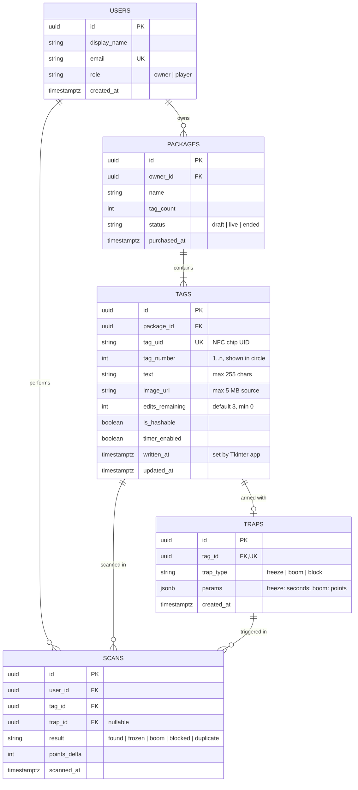

```mermaid

erDiagram
    USERS ||--o{ PACKAGES : owns
    PACKAGES ||--|{ TAGS : contains
    TAGS ||--o| TRAPS : "armed with"
    USERS ||--o{ SCANS : performs
    TAGS ||--o{ SCANS : "scanned in"
    TRAPS ||--o{ SCANS : "triggered in"

    USERS {
        uuid id PK
        string display_name
        string email UK
        string role "owner | player"
        timestamptz created_at
    }
    PACKAGES {
        uuid id PK
        uuid owner_id FK
        string name
        int tag_count
        string status "draft | live | ended"
        timestamptz purchased_at
    }
    TAGS {
        uuid id PK
        uuid package_id FK
        string tag_uid UK "NFC chip UID"
        int tag_number "1..n, shown in circle"
        string text "max 255 chars"
        string image_url "max 5 MB source"
        int edits_remaining "default 3, min 0"
        boolean is_hashable
        boolean timer_enabled
        timestamptz written_at "set by Tkinter app"
        timestamptz updated_at
    }
    TRAPS {
        uuid id PK
        uuid tag_id FK, UK
        string trap_type "freeze | boom | block"
        jsonb params "freeze: seconds; boom: points"
        timestamptz created_at
    }
    SCANS {
        uuid id PK
        uuid user_id FK
        uuid tag_id FK
        uuid trap_id FK "nullable"
        string result "found | frozen | boom | blocked | duplicate"
        int points_delta
        timestamptz scanned_at
    }

```
