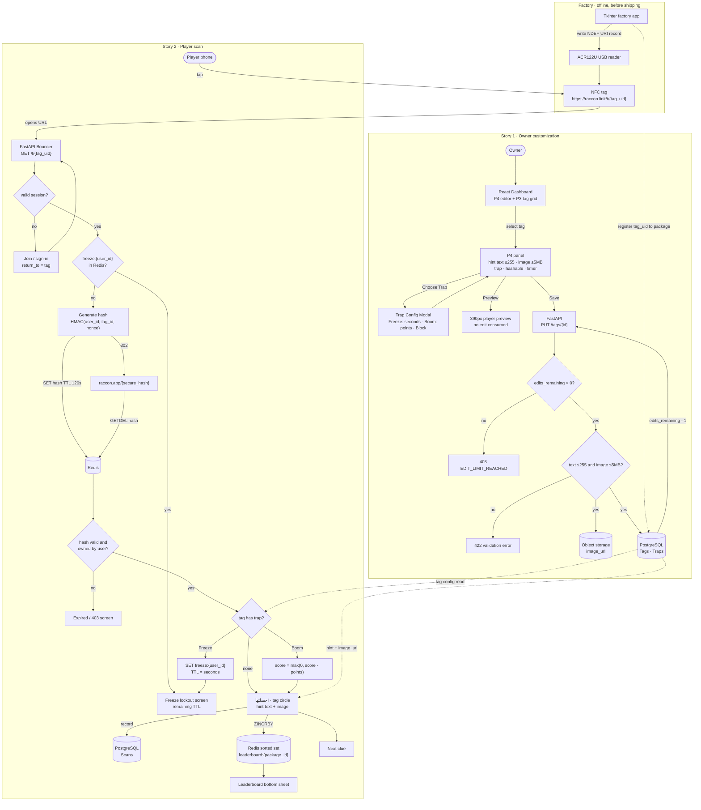
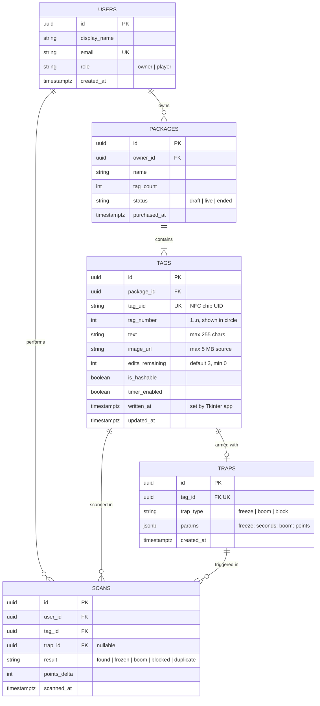

# Raccon — Technical Documentation & Figma Blueprints

Sep 30, 2026 · @e

## 1. Prioritized user stories and acceptance criteria

Both stories are **Must** for the MVP: without tag customization there is no experience to play, and without scanning there is no player. Capabilities inside each story are prioritized below.

| ID | Story | Priority | Key constraints |
| --- | --- | --- | --- |
| US-01 | As an NFC package owner, I want to customize individual tags so I can create an experience that fits my expectations. | Must | Text ≤ 255 chars · image ≤ 5 MB · max 3 edits per tag · traps: Freeze, Boom, Block |
| US-02 | As a player, I want to scan NFC tags so I am able to interact with the experience. | Must | Scan → FastAPI Bouncer → user-bound hash → `raccon.app/secure_hash` validated in Redis |

| Capability | Story | MoSCoW |
| --- | --- | --- |
| Split-view dashboard (P4 editor + P3 tag grid) | US-01 | Must |
| Hint text (≤ 255) + image upload (≤ 5 MB) | US-01 | Must |
| Edit limit (3 per tag) with remaining counter | US-01 | Must |
| Trap selection + config modal (Freeze, Boom) | US-01 | Must |
| Block trap | US-01 | Should |
| Hashable / Timer toggles | US-01 | Should |
| Preview of player view | US-01 | Should |
| Scan, Bouncer redirect, hint display | US-02 | Must |
| Freeze lockout screen | US-02 | Must |
| Leaderboard bottom sheet | US-02 | Should |
| Celebration micro-interaction (حصلتها!) | US-02 | Could |
| Owner analytics per tag | — | Won't (this release) |

### US-01 — Owner tag customization

```gherkin
Feature: Owner customizes individual NFC tags

  Background:
    Given I am signed in as an owner
    And I own a purchased package "Riyadh Season Hunt" with 11 tags
    And I am on the Customization Dashboard

  Scenario: Select a tag from the P3 grid
    When I click tag card "#04" in the P3 panel
    Then the P4 panel loads the configuration of tag "#04"
    And tag card "#04" shows the Selected state
    And the P4 header shows "Edits remaining: 3 of 3"

  Scenario: Save valid hint text and image
    Given tag "#04" has 3 edits remaining
    When I enter hint text of 180 characters
    And I upload a PNG image of 2.4 MB
    And I click "Save"
    Then the configuration is persisted for tag "#04"
    And edits_remaining for tag "#04" becomes 2
    And a success toast "Tag saved" is shown for 3 seconds
    And the package progress indicator updates to include tag "#04" as configured

  Scenario: Reject hint text over 255 characters
    When I type the 256th character in the hint field
    Then the input does not accept the character
    And the counter shows "255/255" in the error colour
    And the "Save" button remains enabled only for the valid 255-char value

  Scenario: Reject image over 5 MB
    When I upload an image of 5.1 MB
    Then the upload is rejected before transfer
    And the error "Image must be 5 MB or smaller" is shown under the upload zone
    And the previous image, if any, is kept

  Scenario: Reject unsupported file type
    When I upload a file "clue.pdf"
    Then the upload is rejected
    And the error "Use JPG, PNG or WEBP" is shown

  Scenario: Warn before the last edit
    Given tag "#04" has 1 edit remaining
    When I click "Save"
    Then a confirmation dialog states "This is your last edit for this tag"
    And the configuration is saved only after I click "Confirm"

  Scenario: Lock a tag with no edits remaining
    Given tag "#04" has 0 edits remaining
    When I select tag "#04"
    Then all P4 inputs are read-only
    And the "Save" button is disabled
    And the label "No edits remaining" is shown
    And the API rejects any PUT to tag "#04" with HTTP 403 "EDIT_LIMIT_REACHED"

  Scenario: Discarded changes do not consume an edit
    Given tag "#04" has 2 edits remaining
    When I change the hint text
    And I select tag "#05" without saving
    Then an "Unsaved changes" dialog is shown
    And choosing "Discard" leaves edits_remaining for "#04" at 2

  Scenario Outline: Open the trap configuration popup
    When I click "Choose Trap"
    And I select the trap "<trap>"
    Then the Trap Configuration Modal opens with the "<trap>" fields

    Examples:
      | trap   |
      | Freeze |
      | Boom   |
      | Block  |

  Scenario: Configure a Freeze trap
    Given the Trap Configuration Modal is open for "Freeze"
    When I set the freeze duration to 60 seconds
    And I click "Apply trap"
    Then the modal closes
    And P4 shows the trap chip "Freeze · 60s"
    And the trap is persisted only when I click "Save" on the tag

  Scenario: Validate Freeze duration bounds
    Given the Trap Configuration Modal is open for "Freeze"
    When I set the freeze duration to 0 or above 600 seconds
    Then "Apply trap" is disabled
    And the helper text "Between 10 and 600 seconds" is shown in the error colour

  Scenario: Configure a Boom trap
    Given the Trap Configuration Modal is open for "Boom"
    When I set the points deduction to 50
    And I click "Apply trap"
    Then P4 shows the trap chip "Boom · −50 pts"

  Scenario: Toggle hashable and timer
    When I switch "Hashable" on
    And I switch "Timer" on
    Then the tag is saved with is_hashable = true and timer_enabled = true

  Scenario: Preview the player view
    Given tag "#04" has unsaved hint text and an image
    When I click "Preview"
    Then a 390 px mobile preview shows the player scan view with my current, unsaved values
    And opening the preview does not consume an edit
```

### US-02 — Player scans a tag

```gherkin
Feature: Player scans NFC tags to interact with the experience

  Background:
    Given tag "#04" is written with NDEF URL "https://raccon.link/t/{tag_uid}"
    And tag "#04" is active in a live package

  Scenario: Scan with a valid session is redirected through the Bouncer
    Given I have a valid player session cookie
    When I tap my phone on tag "#04"
    Then the phone opens "raccon.link/t/{tag_uid}"
    And the FastAPI Bouncer validates my session
    And the Bouncer generates a hash bound to my user_id and tag_id
    And the Bouncer stores the hash in Redis with a TTL of 120 seconds
    And I receive HTTP 302 to "raccon.app/{secure_hash}"

  Scenario: Scan without a session
    Given I have no player session
    When I tap my phone on tag "#04"
    Then the Bouncer redirects me to join or sign in
    And after signing in I am returned to the scan of tag "#04"

  Scenario: Successful scan shows the hint
    Given the Bouncer redirected me to "raccon.app/{secure_hash}"
    When the app validates the hash against Redis
    Then the hash is consumed and deleted from Redis
    And I see the header "حصلتها!"
    And I see the tag number circle "04"
    And I see the hint text and image configured by the owner
    And my score increases and the scan is recorded

  Scenario: Reused or forwarded hash is rejected
    Given the hash "{secure_hash}" was already consumed
    When anyone opens "raccon.app/{secure_hash}"
    Then the app shows "This link has expired, scan the tag again"
    And no points are awarded

  Scenario: Hash bound to another user is rejected
    Given the hash was generated for player A
    When player B opens "raccon.app/{secure_hash}"
    Then the app returns HTTP 403
    And no scan is recorded for player B

  Scenario: Duplicate scan of the same tag
    Given I already scanned tag "#04"
    When I scan tag "#04" again
    Then I see the hint again
    And no additional points are awarded

  Scenario: Freeze trap locks the player out
    Given tag "#07" has a Freeze trap of 60 seconds
    When I scan tag "#07"
    Then I see the Freeze lockout screen with a countdown from 60
    And the Bouncer stores "freeze:{user_id}" in Redis with a TTL of 60 seconds
    When I scan any tag during the countdown
    Then the Bouncer redirects me to the Freeze lockout screen with the remaining seconds
    And no scan is recorded
    When the countdown reaches 0
    Then I can scan again

  Scenario: Boom trap deducts points
    Given tag "#09" has a Boom trap of 50 points
    And my score is 120
    When I scan tag "#09"
    Then my score becomes 70
    And my score never goes below 0

  Scenario: Leaderboard loads in the bottom sheet
    Given I am on the scan result view
    When I drag the leaderboard bottom sheet up
    Then the top 10 players of this package load within 1 second
    And my own rank is pinned at the bottom if I am outside the top 10
    And the leaderboard refreshes after each of my scans
```

## 2. Figma mockup specifications

Three frames, built from one token set: 8 pt spacing grid, Thmanyah for every text layer, and only Raccon palette hexes. Notation: **H** = horizontal auto-layout, **V** = vertical; sizes are W × H as Fixed (number), Fill or Hug; padding is top/right/bottom/left.

### 2.0 Tokens (create as Figma Styles / Variables first)

| Color style | Hex | Use |
| --- | --- | --- |
| Primary/0 | #C0CFC7 | Strokes, dividers, text on dark |
| Primary/1 | #A3B1A9 | Secondary text on dark, disabled |
| Primary/3 | #68766E | Secondary text on light (4.77:1 on white) |
| Primary/5 | #2D3B33 | Nav, P3 panel, mobile background, body text on light |
| Primary/10 | #000000 | Modal scrim (48% opacity) |
| Secondary/0 | #FFFFFF | Cards, P4 panel, modal |
| Secondary/0.5 | #FBF2ED | Desktop canvas background |
| Secondary/5 | #D67948 | Primary CTA fill, selected state, accent |
| Secondary/6 | #AB613A | Accent text on light surfaces (4.23:1, large text only) |
| Secondary/9 | #2B180E | Text on #D67948 (5.39:1) |

Contrast rule: never set white text on #D67948 (3.14:1, fails AA). CTA labels use #2B180E.

| Text style | Font | Weight | Size / Line height | Letter spacing |
| --- | --- | --- | --- | --- |
| Display/Hero | Thmanyah Serif Display | Black | 40 / 48 | 0% |
| Display/Numeral | Thmanyah Serif Display | Black | 64 / 64 | 0% |
| Heading/H2 | Thmanyah Sans | Bold | 24 / 32 | 0% |
| Heading/H3 | Thmanyah Sans | Medium | 18 / 26 | 0% |
| Body/Regular | Thmanyah Sans | Regular | 16 / 26 | 0% |
| Body/Small | Thmanyah Sans | Regular | 14 / 22 | 0% |
| Label/Button | Thmanyah Sans | Bold | 16 / 24 | 0% |
| Caption | Thmanyah Sans | Medium | 12 / 16 | 2% |

Arabic layers: text alignment Right, auto-width off (Fill). Radii: 8 (inputs, chips), 12 (cards, image), 16 (panels), 20 (modal, bottom sheet), 999 (pills, circle).

### 2.1 Desktop Customization Dashboard (1440 px)

```text
Frame "Dashboard / Customize"            V · 1440 × 1024 Fixed · pad 0 · gap 0 · fill #FBF2ED
├─ NavBar                               H · Fill × 72 Fixed · pad 0/40/0/40 · space-between · align center · fill #2D3B33
│  ├─ Logo "Raccon"                     Heading/H2 · #FFFFFF · Hug
│  ├─ NavLinks                          H · Hug · gap 32 · Body/Regular #C0CFC7; active item #FFFFFF + 2 px underline #D67948
│  │  └─ "My packs" · "Customize" · "Leaderboard"
│  └─ Avatar                            40 × 40 Fixed · radius 999 · stroke 2 #C0CFC7
└─ Body                                 H · Fill × Fill · pad 32/40/32/40 · gap 24 · align top
   ├─ P4 / EditorPanel                  V · Fill × Hug · pad 32 · gap 24 · fill #FFFFFF · radius 16 · stroke 1 #C0CFC7
   │  ├─ EditorHeader                   H · Fill × Hug · space-between · align center
   │  │  ├─ Title "Tag #04"             Heading/H2 · #2D3B33
   │  │  └─ EditsBadge (component)      H · Hug · pad 6/12/6/12 · gap 6 · radius 999
   │  │     variants: Remaining=3|2|1|0
   │  │     3,2 → fill #C0CFC7, text #2D3B33 · 1 → fill #F7E4DA, text #80492B · 0 → fill #A3B1A9, text #2D3B33 "Locked"
   │  │     Label: Caption "Edits remaining 3/3"
   │  ├─ Field / ImageUpload            V · Fill × Hug · gap 8
   │  │  ├─ Label "Hint image"          Heading/H3 · #2D3B33
   │  │  ├─ DropZone (component)        V · Fill × 200 Fixed · pad 24 · gap 8 · align center · fill #FBF2ED
   │  │  │  │                           radius 12 · stroke 1.5 dashed (6,6) #A3B1A9
   │  │  │  ├─ Icon upload             32 × 32 · #68766E
   │  │  │  ├─ "Drag an image or browse" Body/Regular #2D3B33
   │  │  │  └─ "JPG, PNG, WEBP · max 5 MB" Body/Small #68766E
   │  │  │  variants: Empty | Hover (stroke #D67948) | Uploading (progress bar) | Filled (thumbnail + Replace) | Error
   │  │  └─ ErrorText (hidden)          Body/Small · #AB613A · "Image must be 5 MB or smaller"
   │  ├─ Field / HintText               V · Fill × Hug · gap 8
   │  │  ├─ Label "Hint text"           Heading/H3 · #2D3B33
   │  │  ├─ TextArea (component)        V · Fill × 120 Fixed · pad 12/16/12/16 · fill #FFFFFF · radius 8
   │  │  │                              stroke 1 #A3B1A9 · Focus: stroke 2 #D67948 · Body/Regular #2D3B33 · align Right
   │  │  └─ Counter "0/255"             Caption · #68766E · align Left · at 255 → #AB613A
   │  ├─ Field / Trap                   H · Fill × Hug · gap 12 · align center
   │  │  ├─ Label "Trap"                Heading/H3 · #2D3B33 · Fill
   │  │  ├─ TrapChip (component)        H · Hug · pad 6/12/6/12 · gap 6 · radius 999 · fill #F7E4DA · Caption #80492B
   │  │  │                              variants: None (hidden) | Freeze "Freeze · 60s" | Boom "Boom · −50 pts" | Block
   │  │  └─ Button/Secondary "Choose Trap"  H · Hug × 44 Fixed · pad 0/20/0/20 · gap 8 · radius 8
   │  │                                 stroke 1.5 #2D3B33 · fill none · Label/Button #2D3B33 · chevron-down 16
   │  ├─ Field / Toggles                H · Fill × Hug · gap 32
   │  │  ├─ ToggleRow "Hashable"        H · Hug · gap 12 · Switch 44 × 24 (On: #2D3B33 track, #FFFFFF knob · Off: #C0CFC7)
   │  │  └─ ToggleRow "Timer"           same component
   │  ├─ Divider                        Fill × 1 · #C0CFC7
   │  └─ ActionBar                      H · Fill × Hug · space-between · align center
   │     ├─ Button/Secondary "Preview" H · Hug × 48 Fixed · pad 0/24/0/24 · stroke 1.5 #2D3B33 · icon eye
   │     └─ Button/Primary "Save"      H · 160 Fixed × 48 Fixed · center · radius 8 · fill #D67948
   │                                    Label/Button #2B180E · Hover fill #DE946D · Pressed #AB613A · Disabled fill #C0CFC7 text #68766E
   └─ P3 / TagsPanel                    V · 440 Fixed × Fill · pad 24 · gap 20 · fill #2D3B33 · radius 16
      ├─ PackageHeader                  V · Fill × Hug · gap 4
      │  ├─ "Riyadh Season Hunt"        Heading/H2 · #FFFFFF
      │  └─ "11 tags · purchased 12 Sep" Body/Small · #A3B1A9
      ├─ PackageProgress (component)    V · Fill × Hug · gap 8
      │  ├─ Row                         H · Fill · space-between · "Configured" / "7 of 11" · Body/Small #C0CFC7
      │  └─ Bar                         Fill × 8 Fixed · radius 999 · track #4A5951 · fill #D67948 (width = 7/11)
      ├─ TagGrid                        H · Wrap · Fill × Hug · gap 16 (row + column) · 4 columns
      │  └─ TagCard × n (component)     V · 86 Fixed × 86 Fixed · pad 12 · gap 4 · center · radius 12
      │     ├─ Number "04"             Heading/H2 · align center
      │     └─ StatusDot / Icon        12 × 12
      │     variants (State):
      │       Empty      fill #4A5951 · stroke 1 #68766E · number #C0CFC7
      │       Configured fill #C0CFC7 · number #2D3B33 · dot #2D3B33
      │       Selected   fill #D67948 · stroke 2 #FFFFFF · number #2B180E
      │       HasTrap    Configured + trap icon 16 #80492B
      │       Locked     fill #4A5951 · number #A3B1A9 · lock icon 12 #A3B1A9
      └─ Legend                         H · Wrap · Fill · gap 16 · Caption #A3B1A9 (Empty · Configured · Selected · Locked)
```

Prototype links: TagCard (On click) → Change to Selected variant + swap P4 content; "Choose Trap" (On click) → Open overlay "Trap Configuration Modal", centred, background #000000 48%, close on outside click; "Preview" → Navigate to "Mobile / Scan Result" (Smart Animate 300 ms ease-out).

### 2.2 Trap Configuration Modal

```text
Overlay "Modal / Trap Config"            V · 560 Fixed × Hug · pad 32 · gap 24 · fill #FFFFFF · radius 20
│                                         effect: drop shadow 0/16/48 #000000 24%
├─ ModalHeader                          H · Fill × Hug · space-between · align center
│  ├─ Title "Configure trap · Tag #04"  Heading/H2 · #2D3B33
│  └─ IconButton close                  40 × 40 Fixed · radius 999 · hover fill #FBF2ED · icon 20 #2D3B33
├─ TrapTypeSelector (component)         H · Fill × 48 Fixed · pad 4 · gap 4 · fill #FBF2ED · radius 12
│  └─ Segment × 3 "Freeze" · "Boom" · "Block"   H · Fill × Fill · gap 8 · center · radius 8 · icon 20
│     Active: fill #2D3B33 · Label/Button #FFFFFF · Inactive: fill none · Label/Button #68766E
├─ TrapDescription                      Body/Regular · #68766E · Fill
├─ Content (swap by variant)            V · Fill × Hug · gap 16
│
│  Variant = Freeze
│  ├─ Label "Freeze duration (seconds)"  Heading/H3 · #2D3B33
│  ├─ Stepper (component)               H · Fill × 56 Fixed · pad 4 · gap 0 · radius 8 · stroke 1 #A3B1A9
│  │  ├─ Button "−"                     48 × 48 Fixed · fill #FBF2ED · radius 6
│  │  ├─ Value "60"                     Fill · Display/Hero at 24/32 · #2D3B33 · center
│  │  └─ Button "+"                     48 × 48 Fixed · fill #FBF2ED · radius 6
│  ├─ PresetChips                       H · Hug · gap 8 · "30s" · "60s" · "120s" · "300s"
│  │                                    Chip: pad 6/14/6/14 · radius 999 · stroke 1 #C0CFC7 · Selected fill #2D3B33 text #FFFFFF
│  └─ Helper "Between 10 and 600 seconds. The player cannot scan any tag while frozen."  Body/Small #68766E
│
│  Variant = Boom
│  ├─ Label "Points deducted"          Heading/H3 · #2D3B33
│  ├─ Stepper (same component)         Value "−50" · #80492B
│  ├─ PresetChips                      "−25" · "−50" · "−100"
│  └─ Helper "Between 1 and 500 points. Scores never go below 0."  Body/Small #68766E
│
│  Variant = Block
│  └─ Helper "The player must scan another tag before this one unlocks."  Body/Regular #68766E
│
└─ ModalFooter                          H · Fill × Hug · gap 12 · align right (packed end)
   ├─ Button/Tertiary "Cancel"          H · Hug × 48 · pad 0/20/0/20 · Label/Button #2D3B33 · no fill
   └─ Button/Primary "Apply trap"       H · Hug × 48 · pad 0/24/0/24 · fill #D67948 · Label/Button #2B180E
```

### 2.3 Mobile Player Scan View (390 px)

```text
Frame "Mobile / Scan Result"             V · 390 Fixed × 844 Fixed · pad 0 · gap 0 · fill #2D3B33 · clip content
├─ StatusBar                            Fill × 47 Fixed (iOS system component)
├─ TopBar                               H · Fill × 56 Fixed · pad 0/20/0/20 · space-between · align center
│  ├─ ScorePill                         H · Hug · pad 6/12/6/12 · gap 6 · radius 999 · fill #4A5951 · Label/Button #FFFFFF "120 pts"
│  └─ PackageName "Riyadh Season Hunt"  Body/Small · #C0CFC7
├─ Content                              V · Fill × Fill · pad 16/24/120/24 · gap 20 · align center (bottom pad clears the sheet peek)
│  ├─ Header "حصلتها!"                  Display/Hero · #D67948 (3.75:1 on #2D3B33, passes large text) · center
│  ├─ TagCircle (component)             V · 160 Fixed × 160 Fixed · center · radius 999 · fill #1B231F · stroke 4 #D67948
│  │  └─ Number "04"                    Display/Numeral · #FFFFFF
│  │  variants: Found (above) | Frozen (stroke #A3B1A9, number → countdown) | Pending (stroke dashed #68766E)
│  ├─ Progress "القطعة 4 من 11"             Body/Small · #C0CFC7 · center
│  └─ HintCard                          V · Fill × Hug · pad 16 · gap 12 · fill #FFFFFF · radius 16
│     ├─ HintImage                      Fill × 180 Fixed · radius 12 · image fill (Crop)
│     ├─ Label "التلميح"                  Caption · #AB613A · align Right
│     └─ HintText                       Body/Regular · #2D3B33 · align Right · Fill · max 255 chars
└─ LeaderboardSheet (absolute, bottom)  V · 390 Fixed × Hug · pad 8/20/34/20 · gap 12 · fill #FFFFFF · radius 20/20/0/0
   │                                      constraints: Left & Right, Bottom · shadow 0/-8/24 #000000 16%
   │                                      variants: Peek (96 visible) | Expanded (520 Fixed)
   ├─ Handle                            40 × 4 Fixed · radius 999 · #C0CFC7 · centred
   ├─ SheetHeader                       H · Fill · space-between · "المتصدرون" Heading/H3 #2D3B33 · "Top 10" Caption #68766E
   ├─ RankList                          V · Fill × Hug · gap 4
   │  └─ RankRow × 10 (component)       H · Fill × 52 Fixed · pad 0/12/0/12 · gap 12 · align center · radius 12
   │     ├─ Rank "1"                    24 Fixed · Label/Button #2D3B33 (1–3: #AB613A)
   │     ├─ Avatar                      32 × 32 · radius 999
   │     ├─ Name                        Body/Regular #2D3B33 · Fill
   │     └─ Points "340"                Label/Button #2D3B33
   │     variants: Default | Me (fill #FBF2ED, stroke 1 #D67948)
   └─ MyRankPinned                      RankRow variant=Me (shown only when rank > 10)

Frame "Mobile / Freeze Lockout"          V · 390 × 844 Fixed · pad 120/24/48/24 · gap 24 · align center · fill #1B231F
├─ Icon snowflake                       64 × 64 · #C0CFC7
├─ Title "تجمّدت!"                       Display/Hero · #FFFFFF
├─ TagCircle variant=Frozen             countdown "60" Display/Numeral #FFFFFF · ring stroke #A3B1A9
├─ Body "لا تقدر تمسح أي قطعة حتى ينتهي الوقت"   Body/Regular · #C0CFC7 · center
└─ Caption "Trap on tag #07"            Caption · #A3B1A9
```

Prototype: Scan Result opens with Smart Animate — TagCircle scale 0.6 → 1.0 (spring, 400 ms), then "حصلتها!" fade-up 16 px (200 ms delay). Sheet: Drag → Expanded variant. Freeze Lockout: After delay 1000 ms → next countdown variant (build 60 → 0 with one variant per second only for the demo; engineering drives the real timer).

Values set by design (confirm with the team): Freeze 10–600 s, Boom 1–500 pts, score floor 0, hash TTL 120 s, leaderboard top 10.

## 3. System architecture

The physical tag only ever stores a static `raccon.link` URL; every rule (edits, traps, sessions, points) lives server-side, so a tag never needs rewriting after the owner edits it.



Key calls: `PUT /tags/{id}` (owner save), `GET /t/{tag_uid}` (Bouncer), `GET /s/{secure_hash}` (hash redemption), `GET /packages/{id}/leaderboard`. Redis holds only short-lived state: scan hashes, freeze locks and the leaderboard sorted set.

## 4. Database design

Five relational tables in PostgreSQL carry durable data; Redis carries only ephemeral keys. A tag has at most one trap, and every scan links one player to one tag.



| Table | Purpose | Key constraints |
| --- | --- | --- |
| users | Owners and players in one table | `role` CHECK in (owner, player); `email` unique |
| packages | A purchased NFC kit | FK `owner_id` → users; `tag_count` matches rows in tags |
| tags | One physical chip and its configuration | `tag_uid` unique; CHECK `char_length(text) <= 255`; CHECK `edits_remaining BETWEEN 0 AND 3`; unique (`package_id`, `tag_number`) |
| traps | Optional trap per tag | `tag_id` unique (0..1 per tag); CHECK on `params`: freeze → `seconds` 10–600, boom → `points` 1–500, block → `{}` |
| scans | Append-only scan log; source for scores | Partial unique (`user_id`, `tag_id`) WHERE `result = 'found'` stops double points; index (`tag_id`, `scanned_at`) |

| Redis key | Type | TTL | Purpose |
| --- | --- | --- | --- |
| `scan:{secure_hash}` | string → `{user_id, tag_id}` | 120 s | One-time redirect token, removed with GETDEL |
| `freeze:{user_id}` | string | trap seconds | Freeze lockout; Bouncer checks before hashing |
| `leaderboard:{package_id}` | sorted set | package life | Live ranks; rebuilt from `scans` if lost |
| `session:{session_id}` | hash | 7 days | Player session checked by the Bouncer |

Edit limit is enforced atomically: `UPDATE tags SET …, edits_remaining = edits_remaining - 1 WHERE id = $1 AND edits_remaining > 0 RETURNING *` — zero rows returned means 403 `EDIT_LIMIT_REACHED`. The image is size-checked by the client and again by the API before upload to storage.

## 5. Team learning progress

Delivering US-01 and US-02 pushed the team from a web-only mindset to a physical-to-digital one: each member learned to treat the NFC tap as the start of a secured, stateful journey rather than a simple link.

| Member | Role | Learning focus in US-01 / US-02 |
| --- | --- | --- |
| Eman Hamdan | Project Manager & UI/UX | Tap-to-screen micro-interactions, Figma auto-layout, Thmanyah design system |
| Abdulrahman Alsalhi | Solution Architect | Stateful session hashing for a secure scan journey |
| Ghaida Alsabti | QA & Backend | FastAPI endpoint validation, Trap logic edge cases |
| Osama Alhamdan | Tech Lead & DevOps | Hardware-to-web pipeline: Tkinter factory app to Redis-backed Bouncer |

**Eman Hamdan — Project Manager & UI/UX.** Eman translated a physical moment, a phone touching a chip, into a sequence of progressive web micro-interactions: the tag circle scaling in, the حصلتها! header rising after it, and the Freeze lockout replacing the hint when a trap fires. She moved the hand sketches of P1–P4 into a component system built on Figma auto-layout, with variants for every tag, edit and trap state, so the owner dashboard and the player view share one source of truth. Building on Thmanyah and the Raccon green and earth scales, she learned to design right-to-left layouts and to check contrast on each pairing, which is why CTA labels sit in #2B180E on #D67948. As Project Manager she turned the two stories into prioritized, testable criteria that the team built and tested against.

**Abdulrahman Alsalhi — Solution Architect.** Abdulrahman designed the stateful session hashing that keeps the scan journey secure while the tag itself stays static. He learned to separate what the chip can safely hold (a public `raccon.link` URL) from what must stay server-side: a hash bound to the player and the tag, stored in Redis with a short TTL and consumed on first use. This design blocks forwarded links, replayed URLs and scans credited to the wrong player. It also gave the Bouncer a single checkpoint for sessions and Freeze locks before any content is served.

**Ghaida Alsabti — QA & Backend.** Ghaida validated the FastAPI endpoints behind both stories, from the owner's `PUT /tags/{id}` to the Bouncer's redirect and hash redemption. Her focus was the edges of the Trap logic: a Freeze timer expiring mid-scan, repeated scans during a lockout, Boom deductions that would push a score below zero, and a save attempted with no edits remaining. Writing tests straight from the Gherkin scenarios taught her to treat acceptance criteria as executable specifications, and to test the 255-character and 5 MB limits at both client and API.

**Osama Alhamdan — Tech Lead & DevOps.** Osama integrated the hardware-to-web pipeline end to end. He connected the offline Tkinter factory app and the ACR122U reader, which write the NDEF URI and register each chip UID against its package, to the live FastAPI and Redis stack that serves players. He learned to manage two very different environments: an offline workstation for chip writing and cloud services for the Bouncer, database and leaderboard. His work ensures a chip written in the factory resolves correctly in the field on first tap.

