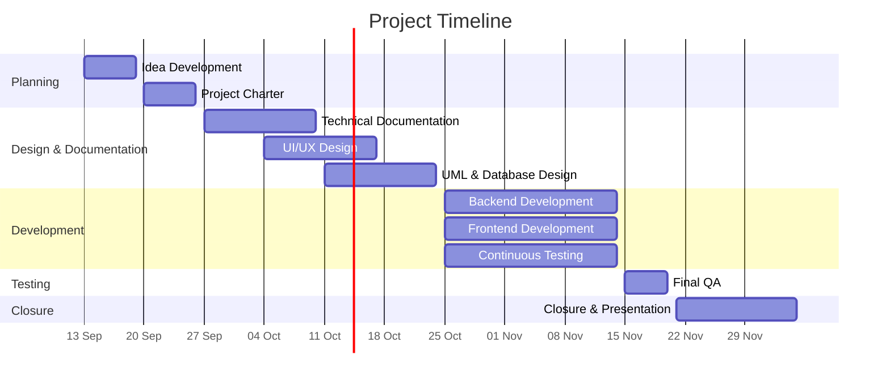

# Project Charter

---

## Table of Contents

* [Executive Summary](#executive-summary)

1. [Project Objectives](#1-project-objectives)

* 1.1 [Idea Description](#11-idea-description)
* 1.2 [Objective 1: Beta Platform Launch](#12-objective-1-beta-platform-launch)
* 1.3 [Objective 2: Customer Acquisition](#13-objective-2-customer-acquisition)

2. [Stakeholders and Roles](#2-stakeholders-and-roles)

* 2.1 [Internal Stakeholders](#21-internal-stakeholders)
* 2.2 [External Stakeholders](#22-external-stakeholders)

3. [Project Scope](#3-project-scope)

* 3.1 [Prioritization (MoSCoW)](#31-prioritization-moscow)
* 3.2 [In Scope](#32-in-scope)
* 3.3 [Out of Scope](#33-out-of-scope)

4. [Risk Management](#4-risk-management)

* 4.1 [Product Risks](#41-product-risks)
* 4.2 [Development Risks](#42-development-risks)
* 4.3 [Risk Matrix (Likelihood × Impact)](#43-risk-matrix-likelihood--impact)

5. [High-Level Project Roadmap](#5-high-level-project-roadmap)

* 5.1 [Phases and Timeline](#51-phases-and-timeline)
* 5.2 [Key Milestones](#52-key-milestones)
* 5.3 [Gantt Chart](#53-gantt-chart)

6. [Authors](#6-authors)

---

## Executive Summary

This project delivers a web-based NFC experience platform that enables customers to create and manage interactive experiences using NFC tags. Each tag links to customizable digital content, such as text, images, and links, allowing customers to design different experiences without changing the underlying NFC technology. Players participate by scanning the NFC tags with their phones, with no dedicated app required.

The platform offers two modes. **Sequential** guides players step by step through a predefined sequence of NFC tags. **Open Hunt** allows players to discover NFC tags freely, follow clues, avoid traps, and earn points in a competitive experience. Both modes can optionally include a timer.

**Objectives**

* **Beta Launch:** Release both experience modes in beta by **November 20, 2026** and validate them through one pilot event with at least 25 participants, a ≥70% Sequential completion rate, and a satisfaction score of ≥4/5.
* **Adoption:** Acquire **25 paying customers** and engage **125 unique players** by **January 31, 2027**.

**Team:** Eman Hamdan (Project Manager, UI/UX & frontend), Abdulrahman Alsalhi (Solution Architect & frontend), Ghaida Alsabti (QA & backend), and Osama Alhamdan (Tech Lead, DevOps & full-stack). External stakeholders include event organizers, destination management companies, customers, and players.

**Scope:** The MVP covers NFC package management, both experience modes, content customization, customer accounts, analytics, and ordering and payment through third-party services. Native mobile apps, NFC hardware development, AI/AR features, and a custom payment gateway are out of scope.

**Key risks:** Loss, theft, damage, or misuse of NFC tags; dependence on third-party services; team unfamiliarity with new technologies; schedule slippage; and scope creep. The main mitigations include tag and package deactivation, tag replacement, optional device binding for NFC tag access, a strict MVP scope, and continuous testing.

**Timeline:** Planning and documentation run from September 13 to October 24, development and testing from October 25 to November 14, final QA from November 15 to 20, and project closure and presentation from November 21 to December 5, 2026.

---

## 1. Project Objectives

### 1.1 Idea Description

The platform enables customers to create and manage interactive experiences using NFC tags. Each NFC tag links to digital content that customers can customize with text, images, and links. This allows the same underlying NFC technology to support different types of experiences without requiring customers to program the tags themselves.

We offer two types of experiences:

* **Sequential Experience:** Guides players step by step through a predefined sequence of NFC tags. Players must scan the tags in the correct order to progress through the experience.
* **Open Hunt Experience:** Allows players to explore freely, with a greater focus on competition, especially when playing in groups. Finding one NFC tag can reveal a clue that leads to another, while some tags can contain traps that cause players to lose points.

Both experience modes can optionally include a timer, allowing customers to decide whether their experience should be time-based.

---

### 1.2 Objective 1: Beta Platform Launch

**Goal Statement:** Launch the beta version of both experience modes (Sequential and Open Hunt) on the NFC experience platform by **November 20, 2026**, achieving measurable player engagement through one pilot event.

| Criteria       | Details                                                                                                                                                                                                                                                                                                                                                        |
| -------------- | -------------------------------------------------------------------------------------------------------------------------------------------------------------------------------------------------------------------------------------------------------------------------------------------------------------------------------------------------------------- |
| **Specific**   | • Complete and deploy the **Sequential Experience** mode: step-by-step progression through a predefined sequence of NFC tags. • Complete and deploy the **Open Hunt Experience** mode: NFC tag discovery, clue-based progression, trap mechanics with point penalties, a leaderboard for team competition, and an optional countdown timer.                 |
| **Measurable** | • Configure at least **10 unique NFC tags per experience mode** for the pilot event. • Reach at least **25 total participants** in the pilot event, with a **≥70% completion rate** for Sequential Experience runs and **≥3 teams** competing in the Open Hunt session. • Collect post-experience feedback with a target satisfaction score of **≥4/5**. |
| **Achievable** | • Build on the existing NFC tag infrastructure. The scope is limited to experience logic, including sequencing, clues, traps, timers, and scoring, rather than new hardware. • Secure **1 pilot partnership** by October 31, 2026, using an event-based use case already identified.                                                                        |
| **Relevant**   | Directly advances the platform's core purpose of providing customizable NFC-based interactive experiences while differentiating the two offerings: structured sequential progression and competitive free-form play.                                                                                                                                           |

**Time-Bound Milestones**

| Milestone                                                   | Deadline          |
| ----------------------------------------------------------- | ----------------- |
| Finalize feature requirements for both modes                | October 5, 2026   |
| Secure and confirm 1 pilot event partnership                | October 31, 2026  |
| Complete Open Hunt mechanics (traps, clues, timer, scoring) | November 1, 2026  |
| Complete internal QA testing of both experience modes       | November 15, 2026 |
| Launch the beta version and conduct pilot testing           | November 20, 2026 |

---

### 1.3 Objective 2: Customer Acquisition

**Goal Statement:** Acquire **25 paying customers** who purchase NFC tag packages through the platform by **January 31, 2027**, generating engagement from at least **125 unique players** following the beta launch on November 20, 2026.

| Criteria       | Details                                                                                                                                                                                                                                                                   |
| -------------- | ------------------------------------------------------------------------------------------------------------------------------------------------------------------------------------------------------------------------------------------------------------------------- |
| **Specific**   | • Attract and convert individuals and businesses into paying customers of the platform. • Drive player participation through customer-created experiences, targeting individuals, event organizers, and businesses interested in interactive NFC experiences.          |
| **Measurable** | • Acquire **25 unique paying customers**, including individuals and companies, by January 31, 2027. • Reach at least **125 unique players** participating in customer-created experiences.                                                                             |
| **Achievable** | • Develop and implement targeted marketing strategies based on market research. • Use the pilot experience and demonstrations to showcase the platform's value and encourage purchases. • Offer a straightforward NFC package purchasing and customization process. |
| **Relevant**   | • Validate whether customers are willing to pay for customizable NFC experiences. • Provide insights into customer demand, purchasing behavior, and player engagement.                                                                                                 |

**Time-Bound Milestones**

| Milestone                                                                            | Deadline          |
| ------------------------------------------------------------------------------------ | ----------------- |
| Design an initial product survey and collect early feedback                          | August 30, 2026   |
| Collect user feedback from LEAP 2026                                                 | September 2, 2026 |
| Develop a marketing strategy based on research and feedback                          | November 10, 2026 |
| Launch the beta version for pilot testing                                            | November 20, 2026 |
| Execute the marketing strategy and improve the platform based on feedback            | December 20, 2026 |
| Reach 25 paying customers and 125 unique players, then evaluate results against KPIs | January 31, 2027  |

---

## 2. Stakeholders and Roles

The following sections identify the key internal and external stakeholders, along with the defined responsibilities of the project team.

### 2.1 Internal Stakeholders

| Name                    | Role                                         | Responsibilities                                                                                                                                                                                                                                                                                                                                                                                                                                                                                                                                                                                                                                                                                                                                         |
| ----------------------- | -------------------------------------------- | -------------------------------------------------------------------------------------------------------------------------------------------------------------------------------------------------------------------------------------------------------------------------------------------------------------------------------------------------------------------------------------------------------------------------------------------------------------------------------------------------------------------------------------------------------------------------------------------------------------------------------------------------------------------------------------------------------------------------------------------------------- |
| **Eman Hamdan**         | • Project Manager  • UI/UX  • frontend | • Co-leads the project with the Tech Lead and owns **workflow and deliverables**. • Plans the project timeline, milestones, and phase deliverables. • Manages the Trello board, assigns tasks, and tracks deliverable deadlines. • Runs daily stand-ups and removes workflow blockers. • Manages scope (MoSCoW) and keeps the MVP on track. • Coordinates with external stakeholders and the pilot partner. • Leads UI/UX design in Figma, including user flows, wireframes, screen states, and the design system, with input from the team. • Develops frontend pages and components in React.                                                                                                                                     |
| **Abdulrahman Alsalhi** | • Solution Architect  • frontend          | • Designs the overall system architecture and project structure. • Creates UML diagrams (use case, class, and sequence diagrams) and architecture maps in Miro. • Leads database schema design, including NFC tag sequencing and experience customization. • Defines technical standards, folder structure, and API contracts between the frontend and backend. • Reviews technical decisions for scalability and alignment with the project scope. • Contributes to UI/UX reviews to ensure that designs remain technically feasible. • Develops frontend features.                                                                                                                                                                   |
| **Ghaida Alsabti**      | • QA  • backend                           | • Writes test plans and test cases for core features (authentication, packages, and experience modes). • Tests features continuously during development and reports bugs. • Runs final QA and integration testing before the beta launch. • Checks that features meet requirements and quality standards, including conducting usability checks against the UI/UX designs. • Develops backend APIs and business logic in FastAPI, including scoring, clues, traps, and timers.                                                                                                                                                                                                                                                               |
| **Osama Alhamdan**      | • Tech Lead  • DevOps  • full-stack    | • Co-leads the project with the Project Manager and owns **technical quality and development progress**. • Tracks development progress and checks that the implementation matches the requirements and architecture. • Reviews code and pull requests to maintain high quality and consistency. • Guides the team through technical challenges and leads knowledge-transfer sessions. • Sets up and maintains the repository, branching strategy, and CI/CD pipelines. • Manages hosting, deployment, and environments (development, staging, and production). • Integrates third-party services (payment gateway and order management) and handles security configuration. • Contributes to both frontend and backend development. |

### 2.2 External Stakeholders

| Role                             | Description                                                                                                         |
| -------------------------------- | ------------------------------------------------------------------------------------------------------------------- |
| Major event organizers           | Organizations that manage large-scale events such as LEAP.                                                          |
| Destination management companies | Companies that organize local activities, tours, and experiences.                                                   |
| Customers                        | Individuals or organizations that purchase NFC tag packages and create and manage experiences through the platform. |
| Players                          | Individuals who participate in experiences by scanning NFC tags and interacting with their content.                 |

---

## 3. Project Scope

### 3.1 Prioritization (MoSCoW)

| Priority        | Features                                                                                                                                                            |
| --------------- | ------------------------------------------------------------------------------------------------------------------------------------------------------------------- |
| **Must have**   | Authentication, NFC tag packages, dashboard, experience modes (Sequential + Open Hunt), password reset, smart links, customer profile, NFC tag/package deactivation |
| **Should have** | Leaderboard, smart-link hashing and optional device binding, up to three post-configuration edits per NFC tag                                                       |
| **Could have**  | UI animations and transitions, congratulation screen, history and favorites, notifications (e.g., WhatsApp)                                                         |
| **Won't have**  | Loyalty program, maps and location-based functionality                                                                                                              |

### 3.2 In Scope

**NFC Package Management**

* Creation and management of NFC tag packages.
* Activation and deactivation of individual NFC tags and entire packages.
* Support for replacing lost or damaged NFC tags.

**Experience Modes**

* Sequential mode, in which NFC tags must be scanned in a defined order.
* Open Hunt mode, in which players discover and claim NFC tags.
* Experience elements such as points, a progress bar, and an optional timer.

**Customization**

* Allow customers to customize the digital content associated with their NFC tags.
* Support customer-provided text, images, and links.
* Provide a simple setup and customization process.
* Allow up to three post-configuration edits per NFC tag.

**Customer & Player Experience**

* Customer accounts for creating and managing NFC tag packages.
* NFC scanning through compatible mobile devices without requiring a dedicated mobile app.
* Package analytics and player participation tracking.

**Ordering & Payment**

* NFC tag package selection and purchasing.
* Integration with a third-party payment gateway.
* Integration with a third-party order management service.

**Testing & Validation**

* Beta release and pilot testing.
* Collection of customer and player feedback.
* Testing of core functionality.

### 3.3 Out of Scope

**Hardware Development**

* Manufacturing NFC tags or developing custom NFC hardware.
* Development of specialized NFC readers or scanning devices.

**Mobile Applications**

* Native iOS or Android applications.
* Features requiring players to install a dedicated application.

**Advanced Experience Features**

* AI-generated hints or experiences.
* Augmented or virtual reality experiences.
* Advanced game-building tools beyond the supported experience modes.

**Internal Business Systems**

* Development of a fully custom payment gateway.
* Development of a complete internal order management system during the initial release.
* Advanced inventory and logistics management.

**Third-Party Services**

* Maintenance of external payment, delivery, or other third-party systems.
* Guarantees regarding the availability of third-party services.

---

## 4. Risk Management

### 4.1 Product Risks

| # | Risk                                                                 | Mitigation                                                                                                                                                                                                                                                                                                                                                                                                           |
| - | -------------------------------------------------------------------- | -------------------------------------------------------------------------------------------------------------------------------------------------------------------------------------------------------------------------------------------------------------------------------------------------------------------------------------------------------------------------------------------------------------------- |
| 1 | Loss or theft of an NFC tag.                                         | Allow package owners to deactivate individual NFC tags, giving them control without disabling the entire package.                                                                                                                                                                                                                                                                                                    |
| 2 | Need to temporarily or permanently deactivate an NFC tag package.    | Allow package owners to deactivate and reactivate an entire package when needed.                                                                                                                                                                                                                                                                                                                                     |
| 3 | Damage to or failure of an NFC tag.                                  | Allow package owners to replace an NFC tag and link the replacement to the existing experience.                                                                                                                                                                                                                                                                                                                      |
| 4 | Dependence on third-party services for payment and order management. | Accept the dependency on a third-party payment gateway while keeping the platform independent where possible. Develop an internal order management system as the platform grows.                                                                                                                                                                                                                                     |
| 5 | Downtime or changes to third-party services.                         | Handle service failures gracefully and avoid making core experience features dependent on external services where possible.                                                                                                                                                                                                                                                                                          |
| 6 | Players bypass the required physical NFC tag scan by sharing tag links with other players or publishing them online.                | Bind each tag link to the authenticated player who scanned it. When a player scans a tag and signs in, a hash (e.g., SHA-1) derived from the player's username is added to the tag URL (e.g., `package/{player_hash}/tag1`). When the link is accessed, the platform compares the hash in the URL with a hash generated from the authenticated player's username. If the hashes do not match, access to the tag content is denied. This approach is intended to discourage direct link sharing, although it is not considered a fully robust security mechanism. |
| 7 | Difficulty using the customization process.                          | Keep package setup simple, provide clear instructions, and improve the process based on pilot feedback.                                                                                                                                                                                                                                                                                                              |

### 4.2 Development Risks

| #  | Risk                                                                                | Mitigation                                                                                                                     |
| -- | ----------------------------------------------------------------------------------- | ------------------------------------------------------------------------------------------------------------------------------ |
| 8  | Team unfamiliarity with new technologies and frameworks, such as FastAPI and React. | Maintain a shared learning resources hub and hold knowledge-transfer sessions among frontend, backend, and other team members. |
| 9  | Development delays.                                                                 | Prioritize MVP features, divide development into clear milestones, and move non-essential features to later releases.          |
| 10 | Expansion of the project scope due to changing requirements.                        | Define the MVP scope early and evaluate new requirements before adding them to the development plan.                           |
| 11 | Late discovery of bugs.                                                             | Test features continuously during development instead of relying only on final-stage testing.                                  |

### 4.3 Risk Matrix (Likelihood × Impact)

The numbers refer to the risk IDs above.

| Likelihood ↓ / Impact → | Very Low | Low | Medium |  High | Very High |
| ----------------------- | :------: | :-: | :----: | :---: | :-------: |
| **Very Likely**         |          |     |    6   |       |    1, 2   |
| **Likely**              |          |     |        | 8, 11 |     3     |
| **Medium**              |          |     |        |   4   |     5     |
| **Unlikely**            |          |     |        |   7   |   9, 10   |
| **Very Unlikely**       |          |     |        |       |           |

---

## 5. High-Level Project Roadmap

### 5.1 Phases and Timeline

| Dates (2026)    | Phase                          |
| --------------- | ------------------------------ |
| Sep 13 – Sep 19 | Idea Development               |
| Sep 20 – Sep 26 | Project Charter                |
| Sep 27 – Oct 10 | Technical Documentation        |
| Oct 4 – Oct 17  | UI/UX Design                   |
| Oct 11 – Oct 24 | UML & Database Design          |
| Oct 25 – Nov 14 | Backend Development            |
| Oct 25 – Nov 14 | Frontend Development           |
| Oct 25 – Nov 14 | Continuous Testing             |
| Nov 15 – Nov 20 | Final QA & Integration Testing |
| Nov 21 – Dec 5  | Project Closure & Presentation |

### 5.2 Key Milestones

| Milestone                         | Date                  |
| --------------------------------- | --------------------- |
| Feature requirements finalized    | October 5, 2026       |
| Pilot partnership confirmed       | October 31, 2026      |
| Open Hunt mechanics complete      | November 1, 2026      |
| Marketing strategy ready          | November 10, 2026     |
| Internal QA complete              | November 15, 2026     |
| **Beta launch / pilot testing**   | **November 20, 2026** |
| Project closure & presentation    | December 5, 2026      |
| 25 paying customers & 125 players | January 31, 2027      |

### 5.3 Gantt Chart

### 6. Authors

* **Eman Hamdan** - [iEmanHamdan](https://github.com/iEmanHamdan)
* **Ghaida Alsabti** - [Ghaaidda](https://github.com/Ghaaidda)
* **Abdulrahman Alsalhi** - [ARAlsalhi](https://github.com/ARAlsalhi)
* **Osama Alhamdan** - [t8pr](https://github.com/t8pr)
