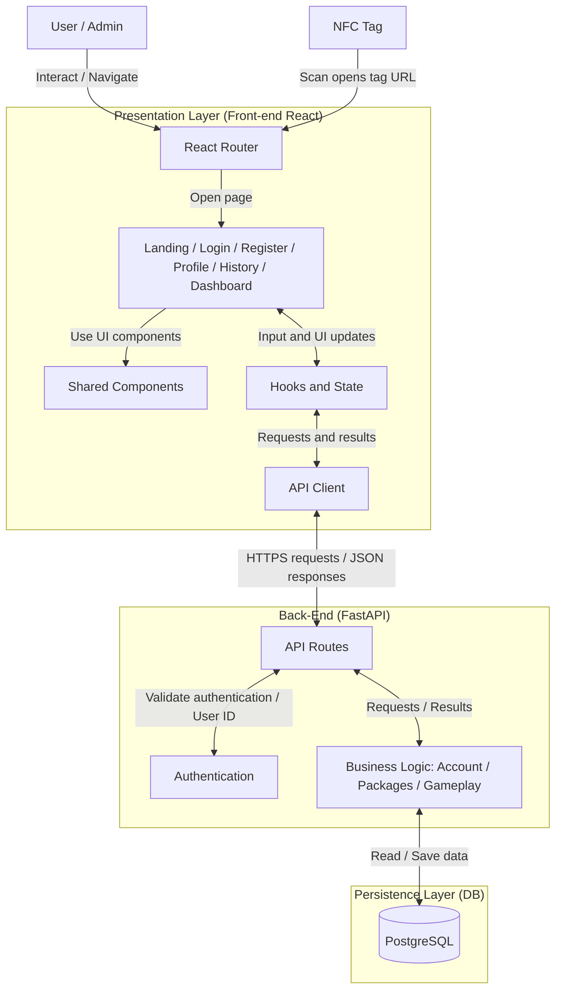
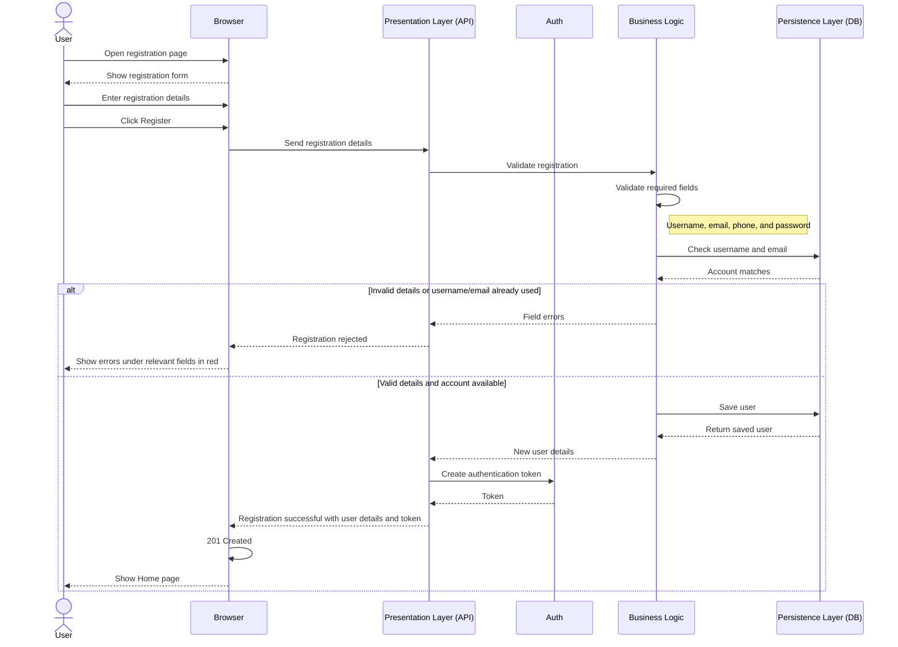
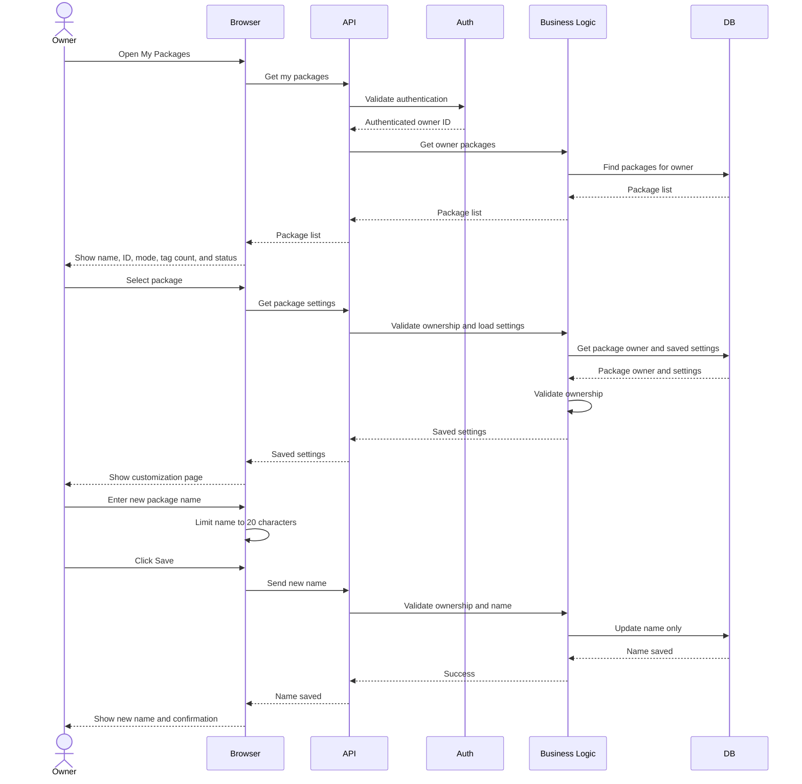
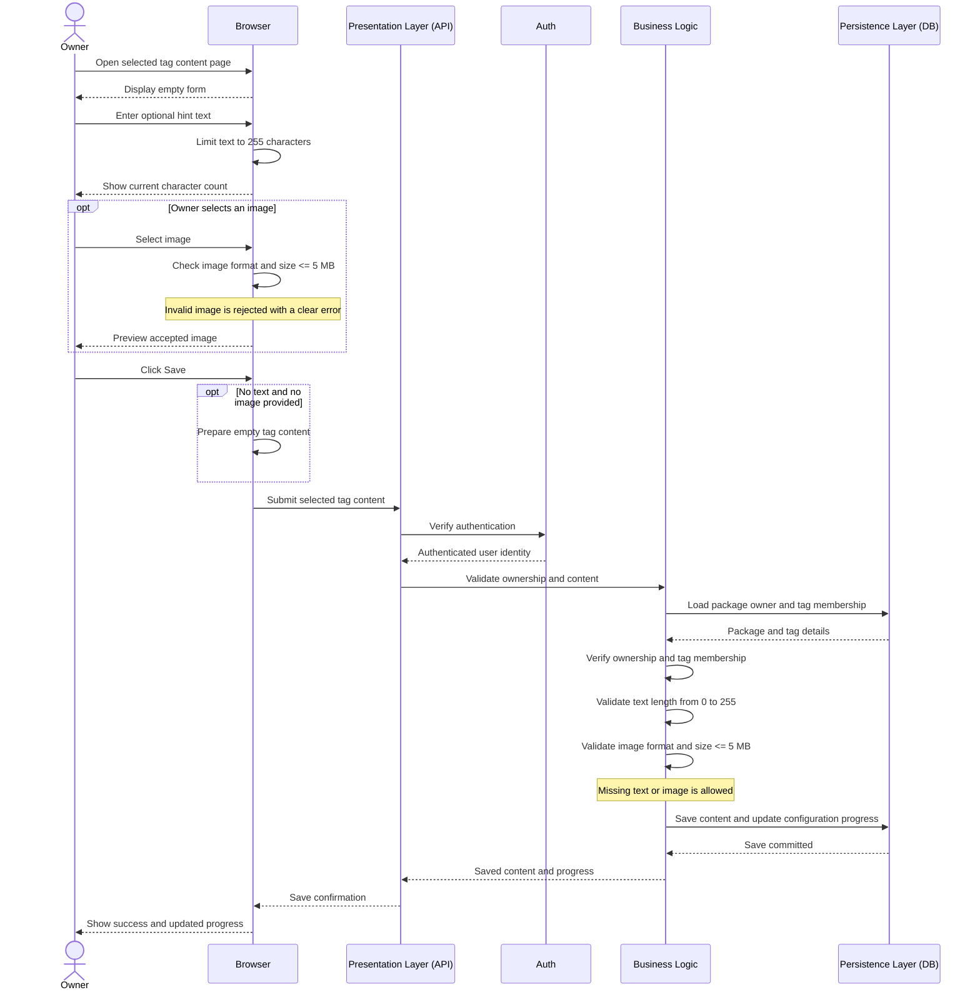
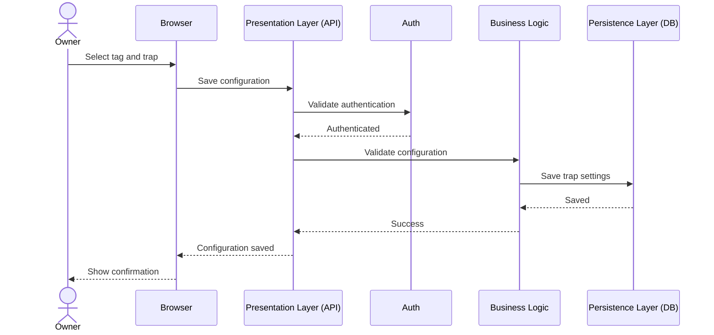
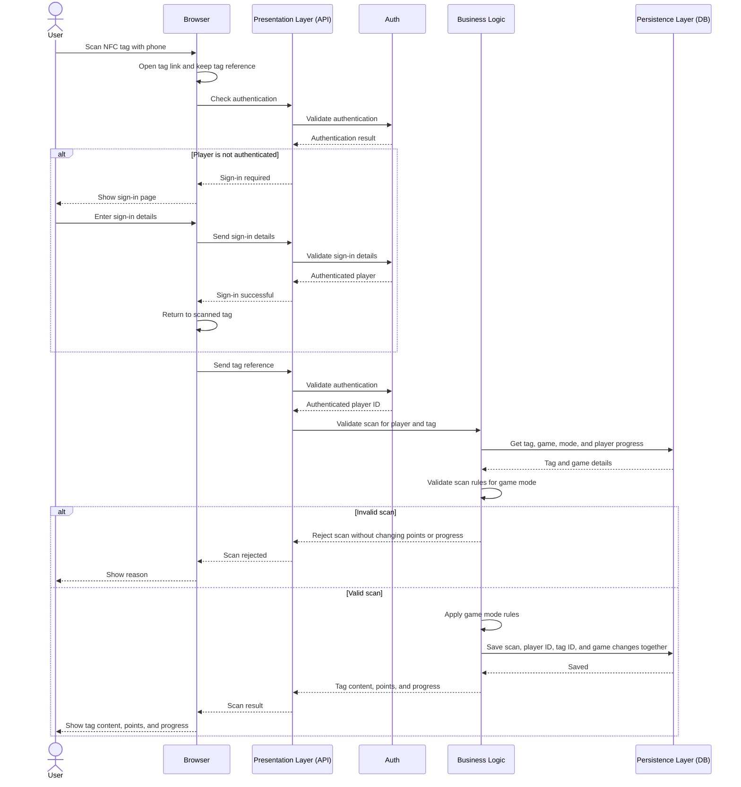

# User Stories

The following user stories describe the Raccon experience from the perspective of three roles. The **Owner** purchases and claims NFC packages, customizes their tags, and manages the experiences they create. The **Player** interacts with those experiences by scanning NFC tags to discover content, progress through the activity, earn points, encounter traps, and view the leaderboard. The **Admin** prepares the physical NFC packages by programming and locking each tag and recording its completion. These roles organize the requirements by who performs each action.

[Owner stories](#owner-stories) · [Player stories](#player-stories) · [Admin stories](#admin-stories)

## Owner Stories

### US-01: Registration

**Category:** Owner &nbsp; · &nbsp; **Priority:** High

**User story**

> As a new visitor,
> I want to register an account,
> So I can buy NFC packages, manage my experiences, or participate in experiences as a player.

**Acceptance criteria**

- The visitor should be able to access the registration page without being signed in.
- If the user already has an account, they can navigate to the login page from the registration page.
- The visitor should be able to select an avatar from the available options, with the first avatar selected by default.
- The registration form should require a name, username, email address, phone number, and password.
- All the registration form fields are mandatory.
- The username and email must be unique and must not already belong to another Raccon account.
- If the entered username is already in use, the system should inform the visitor that the username is unavailable.
- If the entered email address is already registered, the system should inform the visitor that an account already exists with that email.
- The system should validate the format of the entered fields.
- The system should prevent registration until all mandatory fields contain valid values.
- Validation errors should be displayed clearly under the relevant field in red.
- After successful registration, the user should be signed in.
- The created account should be identifiable by the system as an owner or player according to the actions available to that user.

---

### US-02: Log In

**Category:** Owner &nbsp; · &nbsp; **Priority:** High

**User story**

> As a registered user,
> I want to log in to my Raccon account,
> So I can securely access my account.

**Acceptance criteria**

- The user should be able to log in using their username or email address and password.
- Invalid credentials should result in a generic error message without revealing whether a specific account exists.
- After successfully logging in, the user should remain authenticated until their session expires or they log out.
- An authenticated package owner should be able to access packages associated with their account.
- An authenticated player should be able to continue participating in an NFC experience.
- The user should be able to navigate to the Forgot Password page from the login page.
- If a player is redirected to log in after scanning an NFC tag, the system should return the player to the scanned tag after successful authentication.

---

### US-03: Log Out

**Category:** Owner &nbsp; · &nbsp; **Priority:** High

**User story**

> As a registered user,
> I want to log out of my Raccon account,
> So I can end my session when needed.

**Acceptance criteria**

- The authenticated user should be able to access a Log Out option.
- Selecting Log Out should end the user's current session.
- After logging out, the user should be redirected to the login page.
- The user should not be able to access authenticated pages without logging in again.

---

### US-04: Forgot Password

**Category:** Owner &nbsp; · &nbsp; **Priority:** High

**User story**

> As a registered user,
> I want to reset my password if I forget it,
> So I can regain access to my Raccon account.

**Acceptance criteria**

- The sign-in page should display a "Forgot Password?" link.
- Clicking the link should redirect the user to the Forgot Password page.
- The user should be able to enter their registered email address.
- The system should validate the entered email address format.
- After submitting the email address, the system should display a confirmation message indicating that password reset instructions have been sent if the account exists.
- If the email address is associated with a Raccon account, the system should send a password reset link to that email address.
- The password reset link should be unique, time-limited, and usable only once.
- Clicking a valid reset link should redirect the user to a page where they can enter and confirm a new password.
- The system should validate the new password and ensure both password fields match.
- After successfully resetting the password, the system should display a confirmation message and allow the user to return to the sign-in page.
- The user should be able to log in using their new password.
- Expired or previously used reset links should be rejected with a clear error message.

---

### US-05: Manage Account

**Category:** Owner &nbsp; · &nbsp; **Priority:** High

**User story**

> As a registered user,
> I want to manage my Raccon account,
> So I can control my profile information and account settings.

**Acceptance criteria**

- The user should be able to view their profile information.
- The user should be able to edit their username.
- The user should be able to save changes to their profile information.
- The system should display a confirmation message after successfully saving profile changes.
- The user should be able to change their password.
- The user should be required to enter their current password before setting a new password.
- The system should validate the new password before saving it.
- The user should be able to delete their account.
- The system should request confirmation before permanently deleting the account.
- The user should be logged out after successfully deleting their account.

---

### US-06: Claim a Purchased Package

**Category:** Owner &nbsp; · &nbsp; **Priority:** High

**User story**

> As a registered user,
> I want to claim a package I purchased,
> So I can securely access my package and customize its experience.

**Acceptance criteria**

- The user should be able to view the available NFC package options on the Raccon platform.
- Each package option should display its mode (Sequential or Open Hunt), number of NFC tags, and price.
- The user should be able to select a package option and be redirected to its corresponding product page on Ramz to complete the purchase.
- After successfully purchasing a package, the user should receive a unique master authentication link through Ramz, email, and WhatsApp.
- When the user opens the master authentication link, they should be prompted to log in to their Raccon account.
- After successful authentication, the purchased package should be linked to the user's Raccon account.
- The claimed package should appear in the user's purchased packages.
- The user should be able to access the customization page for their claimed package.
- A package that has already been claimed should not be claimable by another account.

---

### US-07: View and Manage Purchased NFC Packages

**Category:** Owner &nbsp; · &nbsp; **Priority:** High

**User story**

> As an NFC package owner,
> I want to view and identify the NFC packages associated with my account,
> So I can access and manage my purchased experiences.

**Acceptance criteria**

- The owner should be able to view all NFC packages associated with their account.
- A newly purchased package should use “Untitled” as its default Package Name.
- Package names can be duplicates.
- Each package should display:
  - Package Name
  - Package ID
  - Mode: Sequential or Open Hunt
  - Number of NFC tags
  - Current status
- The Package ID, mode and number of tags should not be editable.
- The package status should not be directly editable by changing the package information.
- The Package Name should be the only editable package-information field.
- The package name text field maximum characters is 20.
- The owner should be able to rename the package at any time without an edit limit.
- Renaming the package should not count toward the package's customization edit limit.
- The owner should only be able to access packages associated with their account.
- Selecting a package should allow the owner to access its customization interface.
- Previously saved package configurations should remain available when the owner returns to the package.

---

### US-08: NFC Package Customization

**Category:** Owner &nbsp; · &nbsp; **Priority:** High

**User story**

> As a NFC package owner,
> I want to customize the individual tags in my package,
> So I can create experiences that fits my intended activity.

**Acceptance criteria**

- The customization dashboard should display all NFC tags belonging to the selected package.
- Tags should be displayed as numbered circles in ascending order.
- The total number of displayed tags should match the number of tags included in the purchased package.
- The first tag should be selected by default when the customization dashboard is initially opened.
- Selecting another tag should load that tag's current configuration into the customization area.
- The currently selected tag should be visually distinguishable from the remaining tags via hover effect.
- The empty tags, configured tags and current tag should be visually distinguishable.
- The customization area should clearly display the number of the tag currently being edited.
- The owner should be able to configure tags individually while remaining within the same package customization session.
- The owner should be able to save the completed package configuration.

---

### US-09: Customize Tag Content

**Category:** Owner &nbsp; · &nbsp; **Priority:** High

**User story**

> As an NFC package owner,
> I want to add content to an individual NFC tag,
> So players receive the intended hint or information when they discover that tag.

**Acceptance criteria**

- The owner should be able to add optional hint text to a tag.
- Hint text should have a maximum length of 255 characters and minimum of 0 characters.
- The interface should display the current character count.
- The owner should not be able to enter more than 255 characters.
- The text field Thmanabyah, font size 18px, color #2D3B33.
- The owner should be able to optionally upload an image.
- Supported image formats should be JPG, PNG, and WEBP.
- An uploaded image should not exceed 5 MB.
- Unsupported files should be rejected with a clear validation message.
- Images larger than 5 MB should be rejected with a clear validation message.
- If replacing an existing image fails validation, the previously saved image should remain unchanged.
- Text and image content should both be optional, allowing the owner to configure a tag with text only, an image only, both, or no content.
- Clicking Save should persist the configuration for the currently selected tag.
- After a successful save, the interface should provide confirmation that the tag was saved.
- Successfully configuring a previously empty tag should update the package configuration progress.
- Navigating away from a tag with unsaved changes should warn the owner before those changes are discarded.

---

### US-10: Edit a Saved Package Configuration

**Category:** Owner &nbsp; · &nbsp; **Priority:** High

**User story**

> As an NFC package owner,
> I want to edit a previously saved package configuration,
> So I can correct or update the experience after its initial customization.

**Acceptance criteria**

- A package should allow a maximum of three editing sessions after its initial configuration is saved.
- The edit limit should apply to the entire package, not to individual tags.
- A saved package should not be directly editable until the owner explicitly selects Edit.
- Selecting Edit should open the entire package for editing.
- Once editing is enabled, the owner should be able to modify any configurable tag or package-level setting as they would during the initial customization.
- Editing only one tag should still count as one package editing session.
- Editing multiple tags during the same editing session should still count as only one package edit.
- The interface should display how many package edits remain.
- Entering the customization page without making and saving changes should not consume an edit.
- Previewing the package should not consume an edit.
- Discarding changes should not consume an edit.
- An edit should only be consumed when changes from an editing session are successfully saved.
- When one edit remains, the system should warn the owner before saving that this will use the package's final edit.
- Once all three package edits have been used, the package configuration should become read-only.
- The Package Name should remain editable even when no customization edits remain.

---

### US-11: Configure Freeze Trap

**Category:** Owner &nbsp; · &nbsp; **Priority:** Medium

**User story**

> As an Open Hunt NFC package owner,
> I want to assign a Freeze trap to selected NFC tags,
> So I can temporarily prevent players from continuing the experience.

**Acceptance criteria**

- The owner should be able to configure an individual tag as a Freeze trap.
- Only one trap type should be assigned to a tag at a time.
- When the owner selects Freeze, they should be prompted to specify the Freeze duration.
- The Freeze duration should be selectable in 30-second increments, ranging from 30 seconds to 3 minutes.
- Values outside the allowed range should not be accepted.
- The Freeze configuration should only become active after the package configuration is successfully saved.
- Changes to the Freeze configuration after the initial save should follow the package editing rules defined in US-10.
- A player who successfully scans the tag should be frozen for the configured duration.
- While frozen, the player should not be able to successfully scan another tag.
- The Freeze countdown should be tracked independently for each player.
- Re-scanning the same Freeze tag while frozen should display the remaining time without restarting the countdown.
- A Freeze tag should never become claimed and should remain available to all players throughout the experience.

---

### US-12: Configure Boom Trap

**Category:** Owner &nbsp; · &nbsp; **Priority:** Medium

**User story**

> As an Open Hunt NFC package owner,
> I want to assign a Boom trap to selected NFC tags,
> So I can introduce point penalties into the experience.

**Acceptance criteria**

- The owner should be able to configure an individual tag as a Boom trap.
- Only one trap type should be assigned to a tag at a time.
- When the owner selects Boom, the point deduction should be fixed at one point.
- The Boom configuration should only become active after the package configuration is successfully saved.
- Changes to the Boom configuration after the initial save should follow the package editing rules defined in US-10.
- A player who successfully scans the tag should lose one point.
- A player's score should never fall below zero.
- A Boom tag should never become claimed and should remain available to all players throughout the experience.
- The same player should not be able to trigger the same Boom tag twice consecutively.
- Re-scanning the same Boom tag consecutively should not result in an additional point deduction.
- After successfully scanning a different tag, the player should be able to trigger the previous Boom tag again.
- One player's interaction with a Boom tag should not affect another player's ability to trigger it.

---

### US-13: Configure Choose Trap

**Category:** Owner &nbsp; · &nbsp; **Priority:** Medium

**User story**

> As an Open Hunt NFC package owner,
> I want to assign a Choose Trap to selected NFC tags,
> So players can determine the trap behavior that affects other players during the experience.

**Acceptance criteria**

- The owner should be able to configure an individual tag as a Choose Trap.
- Only one trap type should be assigned to a tag at a time.
- The Choose Trap configuration should only become active after the package configuration is successfully saved.
- Changes to the Choose Trap configuration after the initial save should follow the package editing rules defined for package customization.
- A Choose Trap tag should never become claimed and should remain available throughout the Open Hunt experience.
- Multiple players should be able to interact with the same Choose Trap tag.
- When a player is allowed to configure the trap, they should be able to choose between Freeze and Boom.
- Selecting Freeze should prompt the player to specify a duration selectable in 30-second increments, ranging from 30 seconds to 3 minutes.
- Selecting Boom should configure a deduction of one point.
- The player should only be able to select one trap type.
- The selected configuration should only take effect after the player confirms their choice.
- The player who configures the trap should not be affected by their own selection.
- Any Freeze or Boom behavior configured through Choose Trap should follow the same player-specific rules as a directly configured Freeze or Boom tag.

---

### US-14: Preview Sequential Tag Experience

**Category:** Owner &nbsp; · &nbsp; **Priority:** Medium

**User story**

> As a sequential NFC package owner,
> I want to preview a tag before saving or publishing it,
> So I can understand what the player will see when the tag is scanned.

**Acceptance criteria**

- A Preview button should be available in the tag customization interface.
- Clicking Preview should display a mobile representation of the player's scan-result screen.
- The preview should use the selected tag's current configuration, including unsaved changes.
- The preview should display a circle containing the selected tag number.
- The preview should display the "ﺣﺻﻠﺗﮭﺎ!" heading used in the player experience.
- The preview should display the configured hint text when present.
- The preview should display the configured image when present.
- The preview should use a fixed Sequential experience layout, regardless of the package being customized.
- The preview should display a generic leaderboard with sample player information rather than actual player rankings.
- Opening or closing the preview should not save the package configuration or consume an available package edit.

---

### US-15: Preview Open Hunt Tag Experience

**Category:** Owner &nbsp; · &nbsp; **Priority:** Medium

**User story**

> As an open hunt NFC package owner,
> I want to preview a tag before saving or publishing it,
> So I can understand what the player will see when the tag is scanned.

**Acceptance criteria**

- A Preview button should be available from the tag customization interface.
- Clicking Preview should display a mobile representation of the player's scan-result screen.
- The preview should use the tag's current configuration, including unsaved changes.
- The preview should display a circle with the selected tag number.
- The preview should display the "ﺣﺻﻠﺗﮭﺎ!" heading used in the player experience.
- The preview should display the configured hint text when present.
- The preview should display the configured image when present.
- The preview should use a fixed Open Hunt experience layout, regardless of the package being customized.
- The preview should display a generic leaderboard with sample player information
- Opening or closing a preview should not save the tag or consume one of the available edits.

---

## Player Stories

### US-16: Scan a Hashed NFC Tag

**Category:** Player &nbsp; · &nbsp; **Priority:** Medium

**User story**

> As a player,
> I want tag access to remain associated with the player who physically scanned it,
> So other players cannot use a shared link to bypass the required NFC scan.

**Acceptance criteria**

- A successful physical scan should generate tag access associated with the authenticated player.
- The generated tag link should contain a hash derived from the player's username.
- When the link is accessed, the platform should compare the hash in the link with the authenticated player's username hash.
- If the hashes match, access to the tag content should be allowed.
- If the hashes do not match, access should be denied.
- A tag link shared by one player should not provide access to another authenticated player.
- A rejected shared link should not award progress or points.

---

### US-17: View Successful Sequential Scan Result

**Category:** Player &nbsp; · &nbsp; **Priority:** High

**User story**

> As a player,
> I want to see the result of a successful sequential NFC scan,
> So I know which tag I discovered and can receive its clue or content.

**Acceptance criteria**

- After a successful scan, the player should see the "ﺣﺻﻠﺗﮭﺎ!" heading.
- The scanned tag number should be prominently displayed inside a numbered circle.
- The configured hint text should be displayed when the owner has provided one.
- The configured image should be displayed when the owner has provided one.
- If neither text nor an image is configured, the scan result should still display the relevant tag information.
- If Tags Left is enabled, the number of remaining tags should be displayed.
- If Tags Left is disabled, this information should not be displayed.
- If Timer is enabled, the time left should be displayed.
- The player's progress should be updated.
- The player should be able to access the sequential leaderboard from the scan-result interface.

---

### US-18: View Successful Open Hunt Scan Result

**Category:** Player &nbsp; · &nbsp; **Priority:** High

**User story**

> As a player,
> I want to see the result of a successful open hunt NFC scan,
> So I can earn its points before another player claims it.

**Acceptance criteria**

- After a successful scan, the player should see the "ﺣﺻﻠﺗﮭﺎ!" heading.
- The configured hint text should be displayed when the owner has provided one.
- The configured image should be displayed when the owner has provided one.
- If neither text nor an image is configured, the scan result should still display the relevant tag information.
- The first player to successfully scan an unclaimed tag should claim that tag.
- The first player to claim the tag should receive one extra point.
- tag claimed by Player A should no longer award points to Player B, Player C, or any other player.
- Re-scanning a tag already claimed by the same player should also award no additional points.
- The player should be able to see their current score.
- If Tags Left is enabled, the number of remaining tags should be displayed.
- If Tags Left is disabled, this information should not be displayed.
- If Timer is enabled, the time left should be displayed.
- The player's score should be updated.
- The player should be able to access the open hunt leaderboard from the scan-result interface.

---

### US-19: Experience a Freeze Trap

**Category:** Player &nbsp; · &nbsp; **Priority:** Medium

**User story**

> As an open hunt player,
> I want clear feedback when I activate a Freeze trap,
> So I understand why I temporarily cannot continue scanning tags.

**Acceptance criteria**

- Scanning a tag configured with a Freeze trap should activate the configured Freeze duration.
- The player should be shown a dedicated Freeze screen.
- The Freeze screen should clearly indicate that the player has been frozen.
- A countdown should display the remaining Freeze duration.
- While frozen, attempts to scan other Raccon tags should not be counted as successful scans.
- Scanning another tag during the Freeze period should return the player to the Freeze state and show the remaining time.
- The Freeze duration should continue from the original activation and should not restart because another tag was scanned.
- No points or progression should be awarded for scans rejected during the Freeze period.
- Re-scanning the same freeze tag while already frozen should display the player's existing countdown rather than starting a new Freeze period.
- Once the countdown reaches zero, the player should automatically become eligible to scan tags again.

---

### US-20: Experience a Boom Trap

**Category:** Player &nbsp; · &nbsp; **Priority:** Medium

**User story**

> As an open hunt player,
> I want the result of a Boom trap to be reflected in my score,
> So I can understand the consequence of discovering that tag.

**Acceptance criteria**

- Scanning a tag containing a Boom trap should activate its configured point deduction.
- The configured number of points should be deducted from the player's current score.
- The player's score should never become negative.
- If the deduction exceeds the player's current score, the resulting score should be zero.
- The updated score should be reflected in the player's experience.
- The leaderboard should reflect the player's updated score.
- The scan should record that the Boom trap was triggered.

---

### US-21: View Leaderboard

**Category:** Player &nbsp; · &nbsp; **Priority:** Medium

**User story**

> As a player,
> I want to view the experience leaderboard,
> So I can compare my performance with other players.

**Acceptance criteria**

- The leaderboard should be accessible from the player's scan-result screen.
- The leaderboard should be displayed in a scrollable sheet.
- Each leaderboard entry should display the player's rank, player identity/display name, and score.
- A player’s sequential leaderboard value should represent the highest sequential tag they have successfully scanned.
- A player's open hunt leaderboard score should represent the sum of points they have successfully collected.
- The current player's entry should be visually distinguishable from other entries.
- The leaderboard should reflect changes resulting from valid scans and trap effects.
- The player's leaderboard information should refresh after their scan affects their score or progression.

---

## Admin Stories

### US-22: Prepare an NFC Package

**Category:** Admin &nbsp; · &nbsp; **Priority:** High

**User story**

> As an admin,
> I want to program and lock each NFC tag with its assigned URL,
> So I can prepare a complete physical Raccon package for customers.

**Acceptance criteria**

- The admin should be able to enter a Package ID to load the package configuration and required NFC tags.
- The programming station should indicate which tag to scan next and display the package's programming progress.
- If a scanned tag already contains data, the station should display a red warning and play an error sound.
- A tag containing existing data should not be programmed, and the package's progress should remain unchanged.
- The station should prompt the admin to scan a blank NFC tag.
- If the scanned tag is blank, the station should write its assigned unique URL and apply the configured NDEF/password lock.
- A tag should only be considered successfully programmed after both writing and locking are completed.
- After successful programming and locking, the station should record the tag as "printed" in the backend.
- Once the backend confirms the tag's status, the station should play a success sound and advance to the next tag.
- If programming, locking, or backend recording fails, the station should display an error message and should not count the tag as completed.
- When all required tags are successfully recorded as printed, the station should display "Order 100% Complete."

---

## Figma Mockups

The [Raccon Figma workspace](https://www.figma.com/design/Hdv2zuWiZN8ltgtFmr4mhZ/Raccon-%25E2%2580%2594-User-Stories--Design-System---Mockups?node-id=325-34&p=f&t=XIrNazSEfBlfXD9l-0) brings together project requirements, design foundations, and interface mockups. Its pages are organized into the following sections:

- **Cover and Index:** Introduce the project and track changes and handoff status.
- **Admin:** Documents the brief and user stories in English and Arabic, alongside the sitemap, user flows, and architecture.
- **Foundations:** Defines the brand identity, logo, characters, authentication animation, design tokens for color, typography and spacing, reusable components, and interface copy in Saudi dialect.
- **Intake:** Collects team requests and feedback, with a sandbox for design explorations.

This structure connects the user stories to the design work and gives the team a shared reference for review and implementation.


## System Architecture

Raccon follows a three-layer architecture consisting of a React frontend, a FastAPI backend, and a PostgreSQL database.

### Architecture Layers

| Layer | Technology | Responsibility |
|---|---|---|
| Presentation | React | User interface, navigation, components, and state management |
| Business Logic | FastAPI | API endpoints, authentication, validation, and application logic |
| Persistence | PostgreSQL | Data storage and retrieval through repositories |

### Data Flow

1. The user interacts with the React frontend.
2. React sends HTTP requests to the FastAPI backend.
3. FastAPI authenticates requests, validates data, and executes business logic.
4. The business logic communicates with repositories to access PostgreSQL.
5. Results are returned through FastAPI to React, which updates the user interface.

## High-Level Sequence Diagrams

The following sequence diagrams illustrate the interactions between users, the React frontend, FastAPI backend, authentication service, business logic, and PostgreSQL database during key Raccon operations.

### 1. User Registration



### 2. View and Rename Packages



### 3. Configure NFC Tag Content



### 4. Configure NFC Tag Traps



### 5. NFC Tag Scanning and Gameplay



### Sequence Diagram Overview

| Diagram | Description |
|---|---|
| User Registration | Validates registration details, checks account uniqueness, creates a user, and generates an authentication token. |
| View and Rename Packages | Retrieves the owner's packages, loads package settings, and updates the package name. |
| Configure NFC Tag Content | Validates and saves optional hint text and images for an NFC tag. |
| Configure NFC Tag Traps | Validates and saves trap configurations selected by a package owner. |
| NFC Tag Scanning and Gameplay | Authenticates players, validates NFC scans, applies gameplay rules, and updates player progress. |

## Raccon REST API Documentation

**Version:** 0.1 


### 1. Conventions

#### 1.1 Authentication

Protected endpoints require:

```http
Authorization: Bearer <access_token>
```

The backend identifies the authenticated user from the token; clients must not send a `player_id` to impersonate another player. Owner-only endpoints verify ownership of the requested package. Admin-only endpoints require an explicit admin authorization via credentials.

#### 1.2 Content types and identifiers

- Most requests and responses use `Content-Type: application/json`.

- Login currently uses `application/x-www-form-urlencoded` (OAuth2 form fields).

- All durations  use **seconds**.


### 2. Endpoint summary

| Method | Path | Auth | User story | Status |
|---|---|---|---|---|
| `POST` | `/auth/register` | Public | US-01 | Existing |
| `POST` | `/auth/login` | Public | US-02 | Existing |
| `POST` | `/auth/logout` | User | US-03 | Existing |
| `POST` | `/auth/reset-password` | Public | US-04 | Planned |
| `POST` | `/auth/forgot-password` | Public | US-04 | Planned |
| `POST` | `/auth/change-password` | User | US-05 | Existing |
| `DELETE` | `/auth/delete-account` | User | US-05 | Existing |
| `GET` | `/users/me` | User | US-05 | Existing |
| `PATCH` | `/users/me` | User | US-05 | Existing |
| `GET` | `/api/package-options` | Public | US-06 | Planned |
| `POST` | `/api/packages/claim` | User | US-06 | Planned |
| `GET` | `/api/packages` | Owner | US-07 | Planned |
| `GET` | `/api/packages/{package_id}` | Owner | US-07 | Planned |
| `PATCH` | `/api/packages/{package_id}` | Owner | US-07 | Planned |
| `GET` | `/api/packages/{package_id}/configuration` | Owner | US-08–US-13 | Planned |
| `PUT` | `/api/packages/{package_id}/tags/{tag_id}` | Owner | US-08, US-09, US-10, US-11–US-13 | Planned |
| `POST` | `/api/packages/{package_id}/images` | Owner | US-09 | Planned |
| `POST` | `/api/packages/{package_id}/configuration/save` | Owner | US-08–US-13 | Planned |
| `POST` | `/api/packages/{package_id}/tags/{tag_id}` | Player | US-16–US-20 | Planned |
| `POST` | `/api/packages/{package_id}/tags/{tag_id}/choose-trap` | Player | US-13 | Planned |
| `GET` | `/api/packages/{package_id}/play-state` | Player | US-17–US-20 | Planned |
| `GET` | `/api/packages/{package_id}/leaderboard` | Player | US-21 | Planned |
| `GET` | `/api/admin/packages/{package_id}/tags` | Admin | US-22 | Planned |
| `GET` | `/` | Public | Operations | Existing |
| `GET` | `/health/` | Public | Operations | Existing |
| `POST` | `/api/admin/packages/{package_id}/tags/{tag_id}/printed` | Admin | US-22 | Planned |


### 3. Authentication and user profile

#### 3.1 `POST /auth/register`

**User stories:** US-01.

**Status:** Existing.

**Purpose:** Create an account.  

**Auth:** Public.  

**Content-Type:** `application/json`.

**To Do request:**

```json
{
  "name": "Ahmed Ali",
  "username": "ahmed_ali",
  "email": "ahmed@example.com",
  "phone_number": "512345678",
  "password": "examplePassword",
  "avatar_id": "avatar_03"
}
```

**To Do `201` response:**

```json
{
  "user_id": "user_42",
  "message": "User registered successfully"
}
```

**Validation and rules:** Name, username, email, phone, password, and avatar are mandatory under US-01; username and email must be unique; email format must be valid.

### 3.2 `POST /auth/login`

**User stories:** US-02.

**Status:** Existing.

**Purpose:** Authenticate with username **or email** and password.  

**Auth:** Public.  

**Content-Type:** `application/x-www-form-urlencoded`.

```text
username=ahmed_ali&password=examplePassword
```

**`200` response:**

```json
{
  "access_token": "<jwt>",
  "token_type": "bearer"
}
```

**Rules:** Return a generic invalid-credentials error without disclosing account existence. If login followed an NFC scan, the frontend should preserve the intended tag destination and navigate back to it after login; never blindly trust an arbitrary external redirect URL. 

### 3.3 `POST /auth/logout`

**User stories:** US-03.

**Status:** Existing.

**Purpose:** End the client session.  

**Auth:** User.  

**Request body:** None.

**`200` response:**

```json
{ "message": "Successfully logged out." }
```

### 3.4 `POST /auth/change-password`

**User stories:** US-05.

**Status:** Existing.

**Purpose:** Change password.  

**Auth:** User.  

**Content-Type:** JSON.

```json
{
  "old_password": "oldPassword",
  "new_password": "newPassword"
}
```

**`200` response:**

```json
{ "message": "Password changed successfully" }
```

**Errors:** `400` for incorrect old password; `401` for invalid authentication; `422` for invalid fields.

### 3.5 `DELETE /auth/delete-account`

**User stories:** US-05.

**Status:** Existing.

**Purpose:** Delete authenticated account.  

**Auth:** User.  

**Request body:** None.

**`200` response:**

```json
{ "message": "Account deleted successfully" }
```

**US-05 frontend requirements:** Obtain confirmation before deletion; after success clear the session and return to login.

### 3.6 `GET /users/me`

**User stories:** US-05.

**Status:** Existing.

**Purpose:** Retrieve current profile.  

**Auth:** User.  

**Request body:** None.

**`200` response (illustrative):**

```json
{
  "id": "user_42",
  "name": "Ahmed Ali",
  "username": "ahmed_ali",
  "email": "ahmed@example.com",
  "phone_number": "512345678",
  "avatar_id": "avatar_03"
}
```


### 3.7 `PATCH /users/me`

**User stories:** US-05.

**Status:** Existing.

**Purpose:** Update editable profile fields.  

**Auth:** User.  

**Content-Type:** JSON; all fields optional.

```json
{
  "name": "Ahmed Mohammed",
  "username": "ahmed_m",
  "phone_number": "598765432"
}
```

**`200` response:** Updated user profile in the same shape as `GET /users/me`.  

**Rules:** Enforce username uniqueness.

### 3.8 `GET /` and `GET /health/`

**Status:** Existing.

**Purpose:** Basic operational checks.  

**Auth:** Public.  

**Request body:** None.

Example responses from the previously reviewed backend:

```json
{ "message": "System is running. Database connected!" }
```

```json
{ "status": "ok", "message": "Raccon APIs is running!" }
```

### 3.9 `POST /auth/forgot-password`

**User story:** US-04 — Forgot Password.  
**Status:** Planned.  
**Auth:** Public.  
**Content-Type:** `application/json`.

**Proposed request:**

```json
{ "email": "ahmed@example.com" }
```

**Proposed `200` response (same for known and unknown emails):**

```json
{ "message": "If an account exists for this email, password reset instructions have been sent." }
```

**Rules:** Validate email format. For a registered email, send a unique, time-limited, single-use reset link to that address; never return its token in the public API response. The frontend opens the reset-password form from the link. Invalid email format: proposed `422`. Token lifetime, email provider, delivery failure handling, and rate limits require agreement; no numeric defaults are invented here.

### 3.10 `POST /auth/reset-password`

**User story:** US-04 — Forgot Password.  
**Status:** Planned.  
**Auth:** Public; valid reset token required.  
**Content-Type:** `application/json`.

**Proposed request:**

```json
{
  "reset_token": "<single-use-reset-token>",
  "new_password": "newExamplePassword",
  "confirm_password": "newExamplePassword"
}
```

**Proposed `200` response:**

```json
{ "message": "Password reset successfully. Please sign in with your new password." }
```

**Rules:** Validate the token, expiration, unused status, password policy, and equality of both password fields. Persist the new password securely and consume the token atomically only on a successful reset. Reject invalid, expired, or used links with a clear error (proposed `400`);

## 4. Package purchase, claiming, and ownership

### 4.1 `GET /api/package-options`

**User stories:** US-06.

**Status:** Planned.

**Purpose:** Display package purchase options and their Ramz links.  

**Auth:** Public.  

**Query:** None initially.  

**`200` response:**

```json
{
  "options": [
    {
      "option_id": "option_20_open",
      "name": "20-tag Open Hunt",
      "mode": "open_hunt",
      "tag_count": 20,
      "price": { "amount": "<catalog-price>", "currency": "<catalog-currency>" },
      "store_url": "https://<ramz-store>/<product>"
    }
  ]
}
```

### 4.2 `POST /api/packages/claim`

**User stories:** US-06.

**Status:** Planned.

**Purpose:** Associate a purchased package with the authenticated owner using the master authorization link/token.  

**Auth:** User.  

**Content-Type:** JSON.

```json
{ "claim_token": "<single-use-claim-token>" }
```

**`200` response:**

```json
{
  "package_id": "pkg_123",
  "name": "Untitled",
  "mode": "open_hunt",
  "tag_count": 20,
  "status": "unconfigured",
  "owner_id": "user_42"
}
```

**Rules:** Validate token authenticity, expiry, and package association; reject claims for packages already owned by another account.

### 4.3 `GET /api/packages`

**User stories:** US-07.

**Status:** Planned.

**Purpose:** List packages belonging to the authenticated owner.  

**Auth:** Owner.  

**Query:** `page`, `page_size`.

**`200` response:**

```json
{
  "packages": [
    {
      "package_id": "pkg_123",
      "name": "Untitled",
      "mode": "open_hunt",
      "tag_count": 20,
      "status": "configured"
    }
  ]
}
```

### 4.4 `GET /api/packages/{package_id}`

**User stories:** US-07.

**Status:** Planned.

**Purpose:** Retrieve one owned package.  

**Auth:** Owner.  

**Path:** `package_id` required.  

**`200` response:**

```json
{
  "package_id": "pkg_123",
  "name": "Campus Hunt",
  "mode": "open_hunt",
  "tag_count": 20,
  "status": "configured"
}
```

**Rules:** Only owner can access. Package ID, mode, tag count, and status are not editable through package-info updates.

### 4.5 `PATCH /api/packages/{package_id}`

**User stories:** US-07.

**Status:** Planned.

**Purpose:** Rename an owned package.  

**Auth:** Owner.  

**Content-Type:** JSON.

```json
{ "name": "Campus Hunt" }
```

**`200` response:**

```json
{ "package_id": "pkg_123", "name": "Campus Hunt" }
```

**Rules:** `name` maximum 20 characters; duplicates permitted; rename at any time; renaming does **not** consume a customization edit. No other fields accepted.

## 5. Package customization

### 5.1 `GET /api/packages/{package_id}/configuration`

**User stories:** US-08–US-13.

**Status:** Planned.

**Purpose:** Load tag list, saved/draft configurations, settings, and remaining edits.  

**Auth:** Owner.  

**Path:** `package_id`.  

**`200` response:**

```json
{
  "package_id": "pkg_123",
  "mode": "open_hunt",
  "status": "configured",
  "edits_used": 1,
  "edits_remaining": 2,
  "settings": {
    "hashing_enabled": false,
    "timer_enabled": true,
    "duration_seconds": 3600,
    "tags_left_enabled": true
  },
  "tags": [
    {
      "tag_id": "tag_01",
      "number": 1,
      "configured": true,
      "hint_text": "Look under the old tree.",
      "image_id": null,
      "points": 1,
      "trap": null
    }
  ]
}
```

**Rules:** Return all tags in ascending order. Whether to return saved and draft versions separately requires a team decision. Frontend handles selected-circle/hover UI, default first-tag selection, and empty/configured/current visual states. Returned tag count must match the purchased package. 

### 5.2 `PUT /api/packages/{package_id}/tags/{tag_id}`

**User stories:** US-08, US-09, US-10, US-11–US-13.

**Status:** Planned.

**Purpose:** Save an individual tag's **draft** configuration.  

**Auth:** Owner.  

**Content-Type:** JSON.  

**Path:** `package_id`, `tag_id`.

**Normal tag:**

```json
{
  "hint_text": "Look under the old tree.",
  "image_id": "img_456",
  "points": 1,
  "trap": null
}
```

**Freeze trap:**

```json
{
  "hint_text": "You found a trap!",
  "image_id": null,
  "trap": { "type": "freeze", "duration_seconds": 60 }
}
```

**Boom trap:**

```json
{
  "trap": { "type": "boom", "deduction": 1 }
}
```

**Choose trap:**

```json
{
  "trap": { "type": "choose" }
}
```

**`200` response:**

```json
{ "tag_id": "tag_01", "draft_saved": true }
```

**Rules:** `hint_text` optional, 0–255 characters; `image_id` optional; at most one trap type per tag; traps only for Open Hunt. Boom deduction is fixed at one point under US-12. Freeze durations under US-11 are exactly 30, 60, 90, 120, 150, or 180 seconds; reject other values.

### 5.3 `POST /api/packages/{package_id}/images`

**User stories:** US-09.

**Status:** Planned.

**Purpose:** Upload a tag image.  

**Auth:** Owner.  

**Content-Type:** `multipart/form-data`.  

**Form field:** `file` (binary JPG, PNG, or WEBP, maximum 5 MB).

**`201` response:**

```json
{
  "image_id": "img_456",
  "image_url": "https://<media-host>/images/img_456.webp"
}
```

**Rules:** Validate real file type and size server-side. Invalid replacement uploads must leave the previously saved image unchanged. 

### 5.5 `POST /api/packages/{package_id}/configuration/save`

**User stories:** US-08–US-13.

**Status:** Planned.

**Purpose:** Commit all pending tag/settings draft changes.  

**Auth:** Owner.  

**Request body:** None (or a draft version identifier if concurrency control is adopted).

**`200` response:**

```json
{
  "package_id": "pkg_123",
  "status": "configured",
  "edits_used": 1,
  "edits_remaining": 2
}
```

**Rules:** Initial save does not consume an edit. A later save with real changes consumes **one** package edit, regardless of number of changed tags. No-op saves and discarded changes consume zero. Once three post-initial edits are used, customization is read-only but renaming remains available. 


## 6. NFC gameplay

### 6.1 `POST /api/packages/{package_id}/tags/{tag_id}`

**User stories:** US-16–US-20.

**Status:** Planned.

**Purpose:** Process an authenticated scan, validate rules, apply effects, and return the display result.  

**Auth:** Player.  

**Path:** `package_id`, `tag_id`.  

**Content-Type:** JSON.

**To Do request:**

```json
{ "tag_access_token": "<optional-access-proof>" }
```

`tag_access_token` is an inherited proposed field, not a finalized username-hash protocol. Its optionality when protection is disabled depends on approval of the unmapped package-wide hashing toggle; optional access cannot be claimed as satisfying US-16. US-16 specifies a username-derived hash in a tag link and comparison against the authenticated player's username hash; mismatches deny access and award no points/progress. The protocol must enforce that requirement rather than accepting a player identity from the body.

**`200` sequential success:**

```json
{
  "result": "success",
  "mode": "sequential",
  "tag_number": 5,
  "content": {
    "hint_text": "Look under the old tree.",
    "image_url": null
  },
  "progress": {
    "highest_tag": 5,
    "tags_left": 15
  },
  "time_remaining_seconds": 1800
}
```

**`200` Open Hunt claim:**

```json
{
  "result": "claimed",
  "mode": "open_hunt",
  "tag_number": 5,
  "points_awarded": 2,
  "total_score": 12,
  "content": {
    "hint_text": "You found it!",
    "image_url": null
  }
}
```

`points_awarded` here illustrates configured points plus the **one extra first-claim point** in US-18.

**`200` already claimed:**

```json
{
  "result": "already_claimed",
  "points_awarded": 0,
  "message": "This tag has already been claimed."
}
```

**`200` Freeze activation or repeat during Freeze:**

```json
{
  "result": "frozen",
  "trap": {
    "type": "freeze",
    "remaining_seconds": 50
  },
  "points_awarded": 0
}
```

**`200` Boom activation:**

```json
{
  "result": "boom",
  "trap": {
    "type": "boom",
    "points_deducted": 1
  },
  "total_score": 8
}
```

**Proposed `200` expired timer (expiration policy requires approval):**

```json
{
  "result": "experience_ended",
  "message": "This experience has ended."
}
```

**Rules:**

1. Require authenticated user; return the player to the scanned tag after login if needed.

2. Resolve tag and package, validate ownership of the tag by the package, and validate any enabled link binding.

3. If the player is frozen, return the **existing** remaining countdown for attempted scans; do not restart it or change score/progress.

4. Sequential success updates player progress.

5. In Open Hunt, the first player to successfully scan an **unclaimed normal tag** claims it and receives its points plus one extra point. Subsequent scans by anyone award zero points.

6. Trap tags are **never claimed**; their effects are player-specific. Re-scanning a Freeze tag during an existing freeze returns the same decreasing timer.

7. Boom deducts exactly one point, with score clamped at zero (US-12/US-20). The same player cannot trigger the same Boom tag twice consecutively. After successfully scanning a different tag, that player can trigger it again. Track eligibility independently per player; record valid Boom triggers and reflect updated scores in the leaderboard. Consecutive repeats deduct zero.

8. Return only enabled optional fields (`tags_left`, remaining playtime).

9. Ensure concurrent scans of one unclaimed tag cannot both receive the first-claim reward; implement atomic state changes in the persistence layer.


### 6.2 `POST /api/packages/{package_id}/tags/{tag_id}/choose-trap`

**User stories:** US-13.

**Status:** Planned.

**Purpose:** Let a player select/configure a trap after interacting with a Choose tag.  

**Auth:** Player.  

**Content-Type:** JSON.

```json
{
  "trap_type": "freeze",
  "duration_seconds": 60
}
```

**`200` response:**

```json
{
  "result": "trap_configured",
  "tag_id": "tag_05",
  "trap_type": "freeze"
}
```

**Rules:** Choose tags are Open Hunt only, never claimed, and available for interaction by multiple players. Choices are only Freeze or Boom. Freeze accepts 30, 60, 90, 120, 150, or 180 seconds; Boom deducts exactly one point. The request represents the player's confirmed choice, not merely selecting an option in the UI. The chooser must not be affected by their own selection. Applied traps follow the same player-specific Freeze and Boom rules as direct traps.


### 6.3 `GET /api/packages/{package_id}/play-state`

**User stories:** US-17–US-20.

**Status:** Planned.

**Purpose:** Restore current player state when refreshing the page or revisiting a tag.  

**Auth:** Player.  

**Query:** None.

**`200` response:**

```json
{
  "package_id": "pkg_123",
  "mode": "open_hunt",
  "score": 12,
  "highest_sequential_tag": null,
  "freeze_remaining_seconds": 50,
  "time_remaining_seconds": 1800,
  "tags_left": 15,
  "experience_ended": false
}
```

**Rules:** Return values applicable to the selected mode and enabled options. Remaining times should be calculated from authoritative timestamps, not decremented only in browser memory. This endpoint is planned to support persistence and recovery.

## 7. Leaderboard

### 7.1 `GET /api/packages/{package_id}/leaderboard`

**User stories:** US-21.

**Status:** Planned.

**Purpose:** Show ranked players for the current experience.  

**Auth:** Player.  

**Query:** Optional `limit`, `offset` if pagination is needed.

**`200` response:**

```json
{
  "mode": "open_hunt",
  "current_player_id": "user_42",
  "players": [
    {
      "rank": 1,
      "user_id": "user_42",
      "username": "ahmed",
      "score": 25
    },
    {
      "rank": 2,
      "user_id": "user_17",
      "username": "sara",
      "score": 20
    }
  ]
}
```

**Rules:** Open Hunt ranking uses total successfully earned points adjusted by traps. Sequential ranking uses the highest successfully scanned sequential tag; in that mode the numeric field should be renamed to `highest_tag` or a neutral `value` rather than `score`. Frontend highlights the current player.

## 8. Admin and store integration

### 8.1 `POST /api/admin/packages`

**User stories:** US-22.

**Status:** Planned.

**Purpose:** Register/generate a physical package for NFC production.  

**Auth:** Admin.  

**To Do JSON request:**

```json
{ "mode": "sequential", "tag_count": 20 }
```

**Illustrative `201` response:**

```json
{ "package_id": "pkg_123", "status": "unclaimed" }
```

**Open:** Package creation permissions, unique ID generation, master-link lifecycle, physical provisioning process.

### 8.2 `GET /api/admin/packages/{package_id}/tags`

**User stories:** US-22.

**Status:** Planned.

**Purpose:** Retrieve tag identifiers/URLs for the NFC programming station.  

**Auth:** Admin.  

**`200` response:**

```json
{
  "package_id": "pkg_123",
  "tags": [
    { "tag_id": "tag_01", "number": 1, "nfc_url": "https://<frontend-host>/t/<opaque-tag-token>" }
  ]
}
```

### 8.4 `POST /api/webhooks/purchases`

**User stories:** US-06.

**Status:** Planned.

**Purpose:** Receive purchase confirmation from Ramz/store platform and begin the package-claim workflow.  

**Auth:** Verified provider webhook signature or equivalent authentication, **not** a user JWT.  

**Content-Type:** JSON.

**Illustrative normalized payload only (not a verified Ramz schema):**

```json
{
  "event_id": "evt_123",
  "event_type": "order.paid",
  "order_id": "order_456",
  "product_id": "option_20_open"
}
```

**Illustrative `200` response:**

```json
{ "received": true }
```

**Rules:** Verify source authenticity, deduplicate repeated webhook deliveries, and only provision/associate packages for qualifying paid orders. Final path, headers, signature verification, and payload fields depend on the actual provider's documentation.

### 8.5 `POST /api/admin/packages/{package_id}/tags/{tag_id}/printed`

**User story:** US-22 — Prepare an NFC Package.  
**Status:** Planned addition; proposed path and contract.  
**Auth:** Admin.  
**Content-Type:** `application/json`.  
**Path:** `package_id`, `tag_id`.

**Proposed request (station reports both completed operations):**

```json
{ "programmed": true, "locked": true }
```

**Proposed `200` response:**

```json
{
  "package_id": "pkg_123",
  "tag_id": "tag_01",
  "status": "printed",
  "printed_count": 1,
  "required_count": 20,
  "complete": false
}
```

**Rules required by US-22:** Verify admin access and that the tag belongs to the package. Record `printed` only after the station reports successful writing of the assigned unique URL and successful configured NDEF/password locking. A station assertion does not independently prove physical programming; hardware verification details remain part of the station design. Rejected/failed recording must not increment backend completion count. The station beeps and advances only after backend confirmation. When all required tags are recorded as printed, display “Order 100% Complete.”


## 9. External integrations

| Integration | To Do use | Status/qualification |
|---|---|---|
| Axiom | Centralized application logs | Optional integration noted in previously reviewed backend |
| Upstash Redis | Optional live leaderboard/short-lived game state | Planned; assess whether PostgreSQL alone is sufficient |
| Cloudflare R2 | Store tag images/media | Planned |
| GitHub Actions | CI/CD automation | Deployment tool, not a runtime gameplay API |

## 10. Traceability summary

In rows below, `...` means `/api/packages/{package_id}`. Mappings describe coverage, a single endpoint can support multiple stories.

| ID | Final user story | Category | API/frontend coverage | Status and remaining gap |
|---|---|---|---|---|
| US-01 | Registration | Owner | `POST /auth/register` (§3.1) | Existing; avatar and automatic sign-in gap |
| US-02 | Log In | Owner | `POST /auth/login` (§3.2) | Existing; preserve scanned-tag destination |
| US-03 | Log Out | Owner | `POST /auth/logout` (§3.3) | Existing; token revocation limitation |
| US-04 | Forgot Password | Owner | `POST /auth/forgot-password`, `POST /auth/reset-password` (§3.9–3.10) | Planned additions |
| US-05 | Manage Account | Owner | `GET/PATCH /users/me`, `POST /auth/change-password`, `DELETE /auth/delete-account` (§3.4–3.7) | Existing; confirmation/logout UI and deletion consequences |
| US-06 | Claim a Purchased Package | Owner | `GET /api/package-options`, `POST /api/packages/claim` (§4.1–4.2); purchase webhook candidate (§8.4) | Planned; price and required link delivery; provider contract open |
| US-07 | View and Manage Purchased NFC Packages | Owner | `GET /api/packages`, `GET/PATCH /api/packages/{package_id}` (§4.3–4.5) | Planned; owner access and rename rules |
| US-08 | NFC Package Customization | Owner | `GET.../configuration`, `PUT.../tags/{tag_id}`, `POST.../configuration/save` (§5.1–5.2, §5.5) | Planned; dashboard UI frontend |
| US-09 | Customize Tag Content | Owner | `PUT.../tags/{tag_id}`, `POST.../images` (§5.2–5.3) | Planned; individual save/draft interpretation open |
| US-10 | Edit a Saved Package Configuration | Owner | `GET.../configuration`, `PUT.../tags/{tag_id}`, `POST.../configuration/save` (§5.1–5.2, §5.5) | Planned; three sessions; Edit UI and draft contract |
| US-11 | Configure Freeze Trap | Owner | `PUT.../tags/{tag_id}`, `POST.../configuration/save` (§5.2, §5.5) | Planned; 30–180 seconds in 30-second steps |
| US-12 | Configure Boom Trap | Owner | `PUT.../tags/{tag_id}`, `POST.../configuration/save` (§5.2, §5.5) | Planned; fixed one-point Boom, repeat rule |
| US-13 | Configure Choose Trap | Owner | `PUT.../tags/{tag_id}`, `POST.../configuration/save`, `POST.../choose-trap` (§5.2, §5.5, §6.2) | Planned/provisional; persistence/eligibility decision |
| US-14 | Preview Sequential Tag Experience | Owner | No backend endpoint (§5.6) | Frontend-only; Sequential layout, unsaved data, sample leaderboard |
| US-15 | Preview Open Hunt Tag Experience | Owner | No backend endpoint (§5.6) | Frontend-only; Open Hunt layout, unsaved data, sample leaderboard |
| US-16 | Scan a Hashed NFC Tag | Player | Access validation in `POST.../scan` (§6.1) | Planned; username hash requirement; secure protocol unresolved |
| US-17 | View Successful Sequential Scan Result | Player | `POST.../scan`, `GET.../play-state` (§6.1, §6.3); leaderboard (§7.1) | Planned; Sequential result/progress and conditional display |
| US-18 | View Successful Open Hunt Scan Result | Player | `POST.../scan`, `GET.../play-state` (§6.1, §6.3); leaderboard (§7.1) | Planned; normal-tag claim, extra point, no repeat rewards |
| US-19 | Experience a Freeze Trap | Player | `POST.../scan`, `GET.../play-state` (§6.1, §6.3) | Planned; per-player Freeze and unchanged countdown |
| US-20 | Experience a Boom Trap | Player | `POST.../scan`, `GET.../play-state`, leaderboard (§6.1, §6.3, §7.1) | Planned; one point, zero floor, trigger record and repeat eligibility |
| US-21 | View Leaderboard | Player | `GET.../leaderboard` (§7.1) | Planned; mode-specific value and score refresh |
| US-22 | Prepare an NFC Package | Admin | `GET /api/admin/packages/{package_id}/tags`, `POST /api/admin/packages/{package_id}/tags/{tag_id}/printed` (§8.2, §8.5) | Planned; load contract incomplete; safe retry decision |

# SCM and QA Plans

The following plans define the Source Control Management (SCM) strategy and Quality Assurance (QA) approach for the Raccon platform. They support code stability, team collaboration, and automated validation through Continuous Integration and Continuous Deployment (CI/CD).

### Source Control Management (SCM) Strategy

We utilize **GitHub** as our centralized version control system, following a structured branching model to isolate feature development from production-ready code.

#### Branching Strategy

Our repository follows a conceptual workflow that keeps production code safe while allowing parallel development:

- **Production State:** A primary protected branch represents the stable, live state of the application. Code is only merged here after testing and approval.
- **Integration/Development State:** A designated integration branch acts as the staging ground. New features and regular bug fixes are merged here for pre-production testing and team synchronization.
- **Task/Feature Branches:** Developers create temporary branches from the integration branch for specific features, tasks, or non-critical bug fixes. Completed and tested work is merged back through a pull request.
- **Emergency Patch Branches:** For critical production bugs, temporary branches are created directly from the production branch. Fixes are then synchronized across all active environments to maintain consistency.

#### Commit Conventions

Commit messages must describe the change and use a consistent prefix to support readable history and automated changelogs:

- `feat: [description]` — New features.
- `fix: [description]` — Bug fixes.
- `refactor: [description]` — Code changes that neither fix a bug nor add a feature.
- `chore: [description]` — Routine tasks, dependency updates, or configuration changes.

#### Pull Request Workflow

Direct commits to the production and integration branches are restricted. All changes must follow this pull request process:

1. **Open a PR:** Target the appropriate integration or production branch based on the task type.
2. **Pass CI Checks:** All required automated GitHub Actions checks, including linting and testing, must pass.
3. **Obtain Peer Review:** At least one team member must review and approve the PR.
4. **Squash and Merge:** Commits are squashed when merging to keep the repository history clear and readable.

### Quality Assurance (QA) and CI/CD Plan

Quality Assurance is integrated into the SCM workflow through **GitHub Actions**. Automated checks validate code before it reaches staging or production.

#### Testing Strategy

Our QA approach includes three primary layers:

- **Static Analysis and Linting:** Maintain code style consistency and catch issues early using automated tools such as Ruff, Black, and ESLint.
- **Unit Testing:** Test individual functions, database models, and utility scripts in isolation to verify core logic.
- **Integration Testing:** Validate interactions between system components, including API endpoint responses and database transactions, using a dedicated test database.

#### Continuous Integration (CI)

The GitHub Actions CI pipeline runs automatically on pushes and pull requests targeting the production and integration branches. It performs the following steps:

1. **Environment Setup:** Check out the code and configure the required runtime environments, such as Python and Node.js.
2. **Dependency Installation:** Install the application's required packages.
3. **Linting and Formatting Checks:** Run code quality tools. Checks fail when the code does not meet formatting standards.
4. **Test Execution:** Run the automated test suite. Failed required checks block the PR from merging.
5. **Build Verification:** Build the application containers, such as Docker images, to identify build and packaging issues before deployment.

#### Continuous Deployment (CD)

Deployment is automated to reduce human error and ensure consistent delivery across environments:

- **Staging Deployment:** Merging approved PRs into the integration branch automatically triggers deployment to staging, where the team can verify features and integrations in a production-like environment.
- **Production Deployment:** Approved merges into the production branch or designated release tags trigger deployment to production, including pending database migrations and updates to active containers.

#### Monitoring and Post-Deployment QA

After deployment, monitoring helps the team detect errors and availability issues:

- **Centralized Logging:** System errors, API requests, and critical events are sent to a central logging dashboard, such as Axiom, for real-time observability.
- **Health Checks:** Uptime monitors regularly check the `/api/health` endpoint to verify application availability and infrastructure responsiveness.