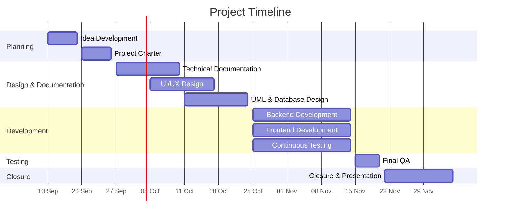

# Project Charter

---

## Table of Contents

- [Executive Summary](#executive-summary)
1. [Project Objectives](#1-project-objectives)
- 1.1 [Idea Description](#11-idea-description)
- 1.2 [Objective 1: Platform Launch](#12-objective-1-platform-launch) 
- 1.3 [Objective 2: Client Acquisition](#13-objective-2-client-acquisition)
2. [Stakeholders and Roles](#2-stakeholders-and-roles)
- 2.1 [Internal Stakeholders](#21-internal-stakeholders)
- 2.2 [External Stakeholders](#22-external-stakeholders)
3. [Project Scope](#3-project-scope)
- 3.1 [Prioritization (MoSCoW)](#31-prioritization-moscow)
- 3.2 [In Scope](#32-in-scope)
- 3.3 [Out of Scope](#33-out-of-scope)
4. [Risk Management](#4-risk-management)
- 4.1 [Product Risks](#41-product-risks)
- 4.2 [Development Risks](#42-development-risks)
- 4.3 [Risk Matrix (Likelihood × Impact)](#43-risk-matrix-likelihood--impact)
5. [High-Level Project Roadmap](#5-high-level-project-roadmap)
- 5.1 [Phases and Timeline](#51-phases-and-timeline)
- 5.2 [Key Milestones](#52-key-milestones)
- 5.3 [Gantt Chart](#53-gantt-chart)
6. [Authors](#authors)

---

## Executive Summary

This project delivers a web-based platform that lets clients build treasure-hunt-style experiences using NFC smart chips. Players scan the chips with their phones, with no app to install. The platform offers two modes. **Sequential** guides players step by step through a place, which suits events like LEAP or Money20/20. **Open Hunt** is timed and competitive: players find hidden chips, follow clues, avoid traps and earn points.

**Objectives**
- **Launch:** release both modes in a Beta by **November 20, 2026**. Validate them through a pilot event with 25+ participants, a ≥70% Sequential completion rate and a satisfaction score of ≥4/5.
- **Adoption:** acquire **25 paying clients** and **125 unique players** by **January 31, 2027**.

**Team:** Eman Hamdan (Project Manager & Front-End), Abdulrahman Alsalhi (Solution Architect & Front-End), Ghaida Alsabti (QA & Backend) and Osama Alhamdan (DevOps & Fullstack). External stakeholders are event organizers, destination management companies and end users.

**Scope:** the MVP covers NFC package management, both experience modes, customization, customer accounts, analytics, and ordering and payment through third-party services, all delivered as a responsive PWA. Native mobile apps, NFC hardware, AI/AR features and a custom payment gateway are out of scope.

**Key risks:** lost, damaged or misused tags, dependence on third-party services, the team learning new technologies, schedule slippage and scope creep. The main mitigations are tag and package deactivation, tag replacement, hashed smart links, a strict MVP scope and continuous testing.

**Timeline:** planning and documentation run from Sep 13 to Oct 24, development and testing from Oct 25 to Nov 14, final QA from Nov 15 to 20, and closure and presentation from Nov 21 to Dec 5, 2026.

---

## 1. Project Objectives

### 1.1 Idea Description

The platform lets users create and customize discovery experiences for different places using smart chips, creating a treasure-hunt-style experience.

We offer two types of experiences:

- **Sequential Experience**: guides users step by step from one place to another. It focuses on discovering and exploring a new place, for example at events like LEAP or Money20/20.
- **Open Hunt Experience**: users explore freely, with more focus on competition, especially when playing in groups. Each smart chip is hidden in a different location. Finding one chip reveals a clue that leads to another chip, and some chips contain traps that make users lose points.

The experience is timed, turning exploration into a fun and competitive challenge.

---

### 1.2 Objective 1: Platform Launch

**Goal Statement:** Launch both experience types (Sequential and Open Hunt) on the discovery platform by **November 20, 2026** (about 2 months from September 21, 2026), achieving measurable user engagement through at least one pilot event.

| Criteria | Details |
|---|---|
| **Specific** | • Complete and deploy the **Sequential Experience** mode: step-by-step guided navigation between locations, aimed at conference and exploration use cases (e.g., LEAP, Money20/20-style events). • Complete and deploy the **Open Hunt Experience** mode: hidden smart chips, clue-based chain discovery, trap mechanics with point penalties, a leaderboard for team competition, and a countdown timer. |
| **Measurable** | • Onboard at least **10 unique locations/chips** per experience in each pilot. • Reach at least **100 total participants** across both pilots, with: &nbsp;&nbsp;– **≥70% completion rate** for Sequential Experience runs &nbsp;&nbsp;– **≥3 teams** competing in at least one Open Hunt session • Collect post-experience feedback with a target satisfaction score of **≥4/5**. |
| **Achievable** | • Build on the existing smart chip infrastructure. Scope is limited to experience logic (sequencing, clues, traps, timers, scoring), not new hardware. • Secure **2 pilot partnerships** by October 31, 2026, using event-based use cases already identified. |
| **Relevant** | Directly advances the platform's core mission: customizable, location-based treasure-hunt discovery experiences, while differentiating the two offerings (guided exploration vs. competitive free-form play). |

**Time-bound Milestones**

| Milestone | Deadline |
|---|---|
| Finalize feature requirements for both modes | October 5, 2026 |
| Secure and confirm 2 pilot event partnerships | October 31, 2026 |
| Complete Open Hunt mechanics (traps, clues, timer, scoring) | November 1, 2026 |
| Internal QA testing of both experience types | November 15, 2026 |

---

### 1.3 Objective 2: Client Acquisition

**Goal Statement:** Acquire at least **25 paying clients** who purchase NFC tag packages through our platform by **January 31, 2027**, generating engagement from at least **125 unique players** within about 2 months of the launch date (November 20, 2026).

| Criteria | Details |
|---|---|
| **Specific** | • Attract and convert individuals and businesses into paying users of the platform. • Drive player participation through customer-created experiences, targeting individuals, event organizers, and businesses interested in interactive, location-based activities. |
| **Measurable** | • Acquire at least **25 unique paying clients**, including individuals and companies, by January 31, 2027. • Reach at least **125 unique players** participating in customer-created experiences. |
| **Achievable** | • Develop and implement targeted marketing strategies based on market research. • Use pilot experiences and demonstrations to showcase the platform's value and encourage purchases. • Offer a straightforward NFC package purchasing and customization process. |
| **Relevant** | • Validates whether clients are willing to pay for customizable NFC experiences. • Provides insights into client demand, purchasing behavior, and player engagement. |

**Time-bound Milestones**

| Milestone | Deadline |
|---|---|
| Design an initial product survey and collect early feedback | August 30, 2026 |
| Collect user feedback from LEAP 2026 | September 2, 2026 |
| Develop a marketing strategy based on research and feedback | November 10, 2026 |
| Launch the Beta version for pilot testing | November 20, 2026 |
| Execute the marketing strategy and improve the platform based on feedback | December 20, 2026 |
| Reach 25 paying clients and 125 unique players, then evaluate results against KPIs | January 31, 2027 |

---

## 2. Stakeholders and Roles

Key internal and external stakeholders, along with defined project team responsibilities.

### 2.1 Internal Stakeholders

| Name | Role | Description |
|---|---|---|
| Eman Hamdan | Project Manager – Frontend | Oversees planning and tracks progress. |
| Abdulrahman Alsalhi | Solution Architect – Frontend | UML and project structure design. |
| Ghaida Alsabti | QA – Backend | Continuous testing to meet quality standards. |
| Osama Alhamdan | DevOps – Full-stack | Maintains software delivery and infrastructure. |

### 2.2 External Stakeholders

| Role | Description |
|---|---|
| Major event organizers | Organizations that manage large-scale events like LEAP. |
| Destination management companies | Companies that organize local activities, tours, and experiences. |
| End users | Individuals who interact with the experience by scanning NFC tags and participating in the activities. |

---

## 3. Project Scope

### 3.1 Prioritization (MoSCoW)

| Priority | Features |
|---|---|
| **Must have** | Authentication, packs, dashboard, modes (Sequential + Open Hunt), password reset, smart link, profile, disabling NFC tag/package |
| **Should have** | Prototype, leaderboard, hashing for smart links, 3 edits |
| **Could have** | Animation, congratulation screen, history + favorites, notifications (e.g., WhatsApp) |
| **Won't have** | Loyalty program, map and locations |

### 3.2 In Scope

**NFC Package Management**
- Creation and management of NFC tag packages.
- Activation and deactivation of individual tags and entire packages.
- Support for replacing lost or damaged tags.

**Experience Modes**
- Sequential mode, where tags must be scanned in a defined order.
- Open Hunt mode, where players discover and claim tags.
- Basic experience elements such as points, a progress bar, and a timer.

**Customization**
- Allow clients to customize their NFC experiences.
- Support user-provided text, images, and links.
- Provide a simple setup and customization process.

**User & Player Experience**
- Customer accounts for creating and managing packages.
- NFC scanning through compatible mobile devices without requiring a dedicated mobile app.
- Package analytics and participation tracking.

**Ordering & Payment**
- NFC package selection and purchasing.
- Integration with a third-party payment gateway.
- Integration with a third-party order management service.

**Platform Development**
- Responsive web platform for desktop and mobile.
- Backend APIs, database, authentication, and authorization.
- A PWA approach to provide an app-like experience through the web.

**Testing & Validation**
- Beta release and pilot testing.
- Collection of customer and player feedback.
- Testing of core functionality.

### 3.3 Out of Scope

**Hardware Development**
- Manufacturing NFC tags or developing custom NFC hardware.
- Development of specialized NFC readers or scanning devices.

**Mobile Applications**
- Native iOS or Android applications.
- Features requiring players to install a dedicated application.

**Advanced Experience Features**
- AI-generated hints or experiences.
- Augmented or virtual reality experiences.
- Advanced game-building tools beyond the supported experience modes.

**Internal Business Systems**
- Development of a fully custom payment gateway.
- Development of a complete internal order management system during the initial release.
- Advanced inventory and logistics management.

**Third-Party Services**
- Maintenance of external payment, delivery, or other third-party systems.
- Guaranteeing availability of third-party services.

---

## 4. Risk Management

### 4.1 Product Risks

| # | Risk | Mitigation |
|---|---|---|
| 1 | An NFC tag is lost or stolen. | Allow package owners to deactivate individual tags, giving them control without disabling the entire package. |
| 2 | A package needs to be temporarily or permanently stopped. | Allow owners to disable and reactivate an entire package when needed. |
| 3 | An NFC tag is damaged or becomes unreadable. | Allow owners to replace a tag and link the replacement to the existing experience. |
| 4 | Reliance on third-party services for payment and order management. | Accept the dependency on a third-party payment gateway while keeping our platform independent where possible. Develop our own order management system as the platform grows. |
| 5 | Third-party service downtime or changes affect the platform. | Handle service failures gracefully and avoid making core experience features dependent on external services where possible. |
| 6 | Unauthorized users access or modify NFC experiences. | Use secure, hashed identifiers so tag access is tied to the device that scanned it, reducing unauthorized access or sharing. |
| 7 | Customers find the customization process too complicated. | Keep package setup simple, provide clear instructions, and improve the process based on pilot feedback. |

### 4.2 Development Risks

| # | Risk | Mitigation |
|---|---|---|
| 8 | Team unfamiliarity with new technologies and frameworks, such as FastAPI and React. | Maintain a shared learning resources hub and hold knowledge-transfer sessions between frontend, backend, and other team members. |
| 9 | Development takes longer than planned. | Prioritize MVP features, divide development into clear milestones, and move non-essential features to later releases. |
| 10 | Changes in requirements increase the project scope. | Define the MVP scope early and evaluate new requirements before adding them to the development plan. |
| 11 | Bugs are discovered late in development. | Test features continuously during development instead of relying only on final-stage testing. |

### 4.3 Risk Matrix (Likelihood × Impact)

Numbers refer to the risk IDs above.

| Likelihood ↓ / Impact → | Very Low | Low | Medium | High | Very High |
|---|:---:|:---:|:---:|:---:|:---:|
| **Very Likely** | | | 6 | | 1, 2 |
| **Likely** | | | | 8, 11 | 3 |
| **Medium** | | | | 4 | 5 |
| **Unlikely** | | | | 7 | 9, 10 |
| **Very Unlikely** | | | | | |

---

## 5. High-Level Project Roadmap

### 5.1 Phases and Timeline

| Dates (2026) | Phase |
|---|---|
| Sep 13 – Sep 19 | Idea Development & Documentation |
| Sep 20 – Sep 26 | Project Charter |
| Sep 27 – Oct 10 | Technical Documentation |
| Oct 4 – Oct 17 | UI/UX Design |
| Oct 11 – Oct 24 | UML & Database Design |
| Oct 25 – Nov 14 | Backend Development |
| Oct 25 – Nov 14 | Frontend Development |
| Oct 25 – Nov 14 | Continuous Testing |
| Nov 15 – Nov 20 | Final QA & Integration Testing |
| Nov 21 – Dec 5 | Project Closure & Presentation |

### 5.2 Key Milestones

| Milestone | Date |
|---|---|
| Feature requirements finalized | October 5, 2026 |
| Pilot partnerships confirmed | October 31, 2026 |
| Open Hunt mechanics complete | November 1, 2026 |
| Marketing strategy ready | November 10, 2026 |
| Internal QA complete | November 15, 2026 |
| **Beta launch / pilot testing** | **November 20, 2026** |
| Project closure & presentation | December 5, 2026 |
| 25 paying clients & 125 players | January 31, 2027 |

### 5.3 Gantt Chart

### 6. Authors
* **Eman Hamdan** - [iEmanHamdan](https://github.com/iEmanHamdan)
* **Ghaida Alsabti** - [Ghaaidda](https://github.com/Ghaaidda)
* **Abdulrahman Alsalhi** - [ARAlsalhi](https://github.com/ARAlsalhi)
* **Osama Alhamdan** - [t8pr](https://github.com/t8pr)
