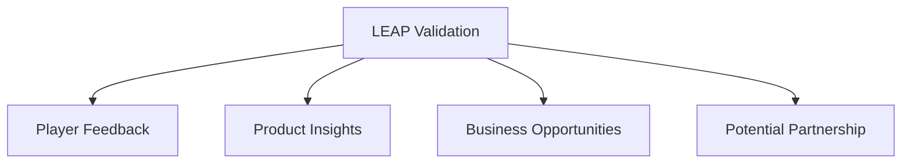

# Stage 1 Report: Team Formation & Idea Dev

### Raccon is comming for your cookies

### Table of Contents

- [Team Formation Overview](#team-formation-overview)
- [Ideas Explored](#ideas-explored)
- [Selected MVP Concept: Raccon](#selected-mvp-concept-raccon)
  1. [Summary](#summary)
  2. [Reasons for Selection](#reasons-for-selection)
- [LEAP26 Validation & Feedback Summary](#leap26-validation--feedback-summary)
  1. [Key Findings](#key-findings)
- [Challenges & Opportunities](#challenges--opportunities)
  1. [Challenges](#challenges)
  2. [Opportunities](#opportunities)
- [Conclusion](#conclusion)
- [Authors](#authors)

## Team Formation Overview

Raccon team, **EAGO TEAM**, will contribute across different areas of software engineering, including business analysis, backend development, frontend development, and DevOps. However, each member will be assigned a primary role to streamline the process of designing, building, and maintaining the project while ensuring clear ownership and responsibilities.

| Member | Role |
| --- | --- |
| **Abdulrahman Alsalhi** - [ARAlsalhi](https://github.com/ARAlsalhi) | Solution Architect - Frontend |
|  **Eman Hamdan** - [iEmanHamdan](https://github.com/iEmanHamdan) | Project Manager - Frontend |
| **Ghaida Alsabti** - [Ghaaidda](https://github.com/Ghaaidda) | QA - Backend |
| **Osama Alhamdan** - [t8pr](https://github.com/t8pr) | DevOps - Full-stack |

## Ideas Explored

The team evaluated multiple concepts before settling on Raccoon platform. The table below summarizes some of the ideas we considered, providing a brief description of each concept along with its key strengths and weaknesses. Additionally, it outlines our reasoning for rejecting or deciding not to pursue each idea further.

| Idea | Description | Strengths | Weaknesses | Outcome |
| --- | --- | --- | --- | --- |
| Clubs WhiteLabel | A unified platform for university clubs across Saudi Arabia to manage activities, attendance, and event documentation in one place. | Highly original, no existing equivalent; addresses a real visibility gap between university clubs buildable with standard, accessible technology. | No clear revenue model; students are unlikely to pay, limiting a subscription approach; technically straightforward, which may not show enough depth for a capstone. | Not rejected, but set aside for a concept with a more distinctive technical twist. |
| Jeneral Pass | A platform connecting freelance journalists with event organizers, letting journalists apply for media/press access while organizers vet credentials before granting passes. | Addresses a real industry problem in press-pass access and verification; could build a professional journalism community; gives journalists early, verified event access. | Current accreditation process isn't well understood yet; journalist adoption is unvalidated; issuing passes may involve legal, identity-verification, and integration complexity. | Not rejected, seen as one of the strongest problems explored, but needs more market, industry, and regulatory research than the project timeline allows. A candidate for future development. |

Neither Clubs WhiteLabel nor Jeneral Pass was rejected for weakness; the team chose to pursue a different concept offering a more distinctive technical challenge, described below.

## Selected MVP Concept: Raccon

### Summary

Raccon is a platform that allows users to create and customize discovery experiences for different places using **NFC Cards**, creating a treasure-hunt-style experience.

It offers two types of experiences. The first is a **Sequential Experience**, which guides users from one place to another step by step. It focuses more on discovering and exploring a new place, for example, at events like LEAP or Money20/20.

The second is an **Open Hunt Experience**, where users can explore freely, with more focus on competition, especially when playing in groups. Each **NFC Card** is hidden in a different location. Finding one card reveals a clue that leads users to another card, while some cards can contain traps that make users lose points. And that will level up the competition.

### Reasons for Selection

| **Reason** | **Description** |
|---|---|
| **1. WOW Factor** | Looking beyond typical software engineering technologies, the team explored the **Near Field Communication (NFC)** cards a short-range wireless technology usually limited to business cards, product tags, payments, and keycards. Inspired by a social media post about a creative NFC use case (someone turning their home into a mini scavenger hunt using fact-tagged NFC chips), the team saw an opportunity to build an underused technology into a capstone project. |
| **2. Vision 2030 Alignment** | NFC-driven physical activity aligns with Saudi Vision 2030's focus on movement and initiatives like the Sports Boulevard, and with tourism, where historic sites could be brought to life through activity based experiences. |
| **3. Technical Appropriateness** | The concept directly applies the capstone's core areas **authentication, databases, and full-stack development** while pushing the team to learn a new frontend framework and design a flexible database schema for experience customization, both seen as valuable learning opportunities. |

## LEAP26 Validation & Feedback Summary

Following our in-person validation at LEAP26 through conversations with entrepreneurs, investors, and event managers, including the **Kingdom of Gaming** team. we gathered vital qualitative insights. While most feedback was verbal, survey results from 10 respondents (9 players, 1 investor) collected from Sep 2–Sep 11 

### Key Findings

| **Feedback Area** | **Key Insight** |
|---|---|
| **NFC Excitement** | 8 out of 9 players responded positively to the technology. |
| **Willingness to Play** | 6 players expressed positive willingness to engage. One price-sensitive response reflected a pricing concern rather than a concept objection. |
| **Pricing Concerns** | Responses ranged from SAR 100–150 to requests for lower pricing, indicating price sensitivity worth testing against an ~SAR 80 ceiling. |
| **Feature Requests** | Two respondents suggested AI-assisted content generation for easier clue and question creation. |
| **Technical Suggestion** | One respondent proposed password-based chip unlocking to enforce sequencing. |
| **Usage Model** | Concerns about engagement fading led to a suggestion for one high-traffic venue with redeemable rewards. |
| **Business Potential** | One respondent identified marketing campaign and retention use cases. |
| **Investor Response** | The investor viewed the concept positively for the Saudi market but flagged customer acquisition and experience clarity risks. |
| **Kingdom of Gaming** | Their team responded positively. A proof of concept will be shared at a later stage. | 

Overall, the validation through direct feedback and suggestions was a significant factor in the team's decision to pursue with **Raccon** over alternative concepts.

## Challenges & Opportunities

The Raccon platform presents risks and possibilities that may be viewed as challenges, opportunities, or both. The following evaluation explores the selected concept’s feasibility and suitability, outlining potential challenges, proposed approaches, and opportunities for growth.

### Challenges

| **Challenge**                   | **Description**                                                                                                                         | **Proposed Approach**                                                                                                                                                                                                                      |
| ------------------------------- | --------------------------------------------------------------------------------------------------------------------------------------- | ------------------------------------------------------------------------------------------------------------------------------------------------------------------------------------------------------------------------------------------ |
| **Sequencing NFC Cards**        | A **Sequential Experience** requires NFC Cards to guide players through an ordered path. How can the platform support this technically? | Initial research suggests a database design in which each card’s record stores its associated content and a reference to the next card in the sequence. The rules for enforcing player progression will be defined during detailed design. |
| **Correcting Saved Content**    | Users may discover a typo or another mistake after saving their customized card content.                                                | Allow users to edit each card’s content up to **three times**, giving them room to correct mistakes after the initial customization.                                                                                                       |
| **Reusing a Purchased Package** | Users may want to create a new game using the NFC Cards they already own.                                                               | Offer a paid option to fully customize a purchased package again, allowing users to create a new experience with the same cards.                                                                                                           |

### Opportunities

| **Opportunity**            | **Description**                                                                                                                                                                                                    |
| -------------------------- | ------------------------------------------------------------------------------------------------------------------------------------------------------------------------------------------------------------------ |
| **Kingdom of Gaming**      | The MVP is planned to launch at [**Kingdom of Gaming**](https://kingdomofgaming.com), providing an opportunity to showcase Raccon’s potential for interactive gaming experiences and gather feedback from players. |
| **Beyond the MVP**         | Making NFC Cards more accessible and encouraging their use in everyday interactive experiences could open opportunities for collaborations with major events, content creators, and brands.                        |
| **User-Driven Creativity** | Customizability gives users the freedom to create their own clues, stories, and experiences. Their creativity could reveal new use cases and help shape the platform’s future development.                         |

The points above summarize the main conclusions we reached as a team during our brainstorming sessions. This initial evaluation focuses on the concept’s feasibility during the ideation phase, with detailed implementation decisions to follow in later stages. 

## Conclusion

This stage established the foundation for Raccon by defining the team’s primary responsibilities, evaluating alternative ideas, and selecting an MVP concept that combines NFC technology with customizable discovery experiences. Feedback gathered at LEAP26 strengthened the team’s confidence in the concept while highlighting areas that require further validation, particularly pricing, sustained engagement, and experience clarity.

### Authors
* **Eman Hamdan** - [iEmanHamdan](https://github.com/iEmanHamdan)
* **Ghaida Alsabti** - [Ghaaidda](https://github.com/Ghaaidda)
* **Abdulrahman Alsalhi** - [ARAlsalhi](https://github.com/ARAlsalhi)
* **Osama Alhamdan** - [t8pr](https://github.com/t8pr)
